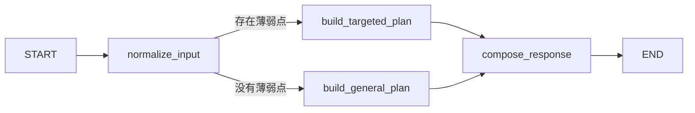

# K12 Agent Runtime

`k12-agent-runtime` 是平台内部的 Python AI 执行服务。它负责智能体编排、模型调用、
RAG、工具调用、异步任务消费，以及未来隔离代码沙箱产生的图表和文件。

## 分层结构

```text
src/k12_agent_runtime/
├── core/                   # 环境配置、日志等横切能力
├── bootstrap/              # 依赖装配，不放业务逻辑
├── domain/                 # Agent、产物、沙箱领域模型和端口
├── application/            # 运行Agent、执行代码等用例
├── infrastructure/         # Agent框架、RabbitMQ、存储、沙箱适配器
├── interfaces/api/         # FastAPI路由和HTTP Schema
├── workers/                # RabbitMQ等独立进程入口
└── main.py                 # FastAPI进程入口
```

依赖方向必须保持：

```text
interfaces/infrastructure -> application -> domain
```

`domain` 不允许导入 FastAPI、RabbitMQ、数据库SDK或具体Agent框架。

## 初始化

```powershell
Set-Location D:\CodeWorkPlace\k12\ai-services\k12-agent-runtime
Copy-Item .env.example .env
uv sync --dev
```

本地 `.env` 不提交Git。配置项统一使用 `K12_AGENT_` 前缀。

千问配置只写入本地 `.env`，不要提交真实密钥：

```dotenv
K12_AGENT_LLM_PROVIDER=dashscope
K12_AGENT_LLM_BASE_URL=https://dashscope.aliyuncs.com/compatible-mode/v1
K12_AGENT_LLM_API_KEY=
K12_AGENT_LLM_MODEL=qwen-plus
```

教学 Agent 通过领域层 `ChatModel` 接口调用模型，基础设施层负责适配千问的 OpenAI 兼容
接口。模型只生成受结构约束的教学文本，动画步骤仍由本地代码生成。模型未配置、超时、
网络失败或输出格式错误时自动回退到确定性讲解，因此本地演示不会被外部模型故障阻断。

## 启动FastAPI

```powershell
uv run k12-agent-runtime
```

需要开发热重载时使用：

```powershell
uv run fastapi dev --host 127.0.0.1 --port 8090
```

默认地址：

- 服务：<http://127.0.0.1:8090>
- Swagger：<http://127.0.0.1:8090/docs>
- 健康检查：<http://127.0.0.1:8090/internal/v1/health>

当前提供的内部接口：

```text
GET  /internal/v1/health
GET  /internal/v1/agents
POST /internal/v1/agents/{agentCode}/invoke
GET  /internal/v1/sandbox/capabilities
POST /internal/v1/sandbox/executions
GET  /internal/v1/rag/capabilities
POST /internal/v1/rag/embeddings
POST /internal/v1/rag/rerank
POST /internal/v1/rag/documents/index
POST /internal/v1/rag/search
```

## 本地BGE检索模型

项目使用两个职责不同的模型：

```text
BAAI/bge-m3                 文本 -> 1024维稠密向量，用于pgvector召回
BAAI/bge-reranker-v2-m3     查询+候选片段 -> 相关性分数，用于Top-K精排
```

Windows和Linux上的PyTorch固定从官方CUDA 12.8索引安装。模型采用延迟加载：FastAPI启动
时不下载模型，也不占用显存；第一次调用对应接口时才从Hugging Face下载并加载。8GB显存的
本地配置：

```dotenv
K12_AGENT_RAG_ENABLED=true
K12_AGENT_EMBEDDING_DEVICE=cuda
K12_AGENT_EMBEDDING_USE_FP16=true
K12_AGENT_EMBEDDING_BATCH_SIZE=8
K12_AGENT_RERANKER_DEVICE=cuda
K12_AGENT_RERANKER_USE_FP16=true
K12_AGENT_RERANKER_BATCH_SIZE=4
```

验证CUDA：

```powershell
uv run python -c "import torch; print(torch.__version__); print(torch.cuda.is_available()); print(torch.cuda.get_device_name(0))"
```

当前已经实现文档切分、pgvector写入、按学段/年级/教材条件召回、Reranker精排，并把受长度
限制的Top-K知识片段接入`teaching-assistant`的LangGraph State和千问上下文。知识片段按
不可信资料处理，不能覆盖系统安全规则；后续仍需补面向用户的引用展示和离线检索评测。
不能直接把完整文档全部发送给生成模型。

### 初始化pgvector知识库

先在准备存放知识向量的PostgreSQL数据库中执行：

```text
sql/001_init_pgvector.sql
```

脚本会创建 `vector` 扩展、`k12_rag` schema、文档表、1024维知识片段表、过滤索引和
HNSW cosine索引。脚本可重复执行，不会删除已有数据。随后在本地 `.env` 配置：

```dotenv
K12_AGENT_RAG_ENABLED=true
K12_AGENT_RAG_DATABASE_URL=postgresql://<username>:<password>@<host>:<port>/<database>
```

数据库密码不能提交Git。`RAG_ENABLED=true` 但未配置连接串时，Embedding和Reranker独立
接口仍可使用，知识文档入库和检索接口返回503。

完整检索顺序：

```text
文档 -> 重叠切分 -> BGE-M3向量化 -> pgvector
问题 -> BGE-M3向量化 -> 按学段/年级/教材召回Top 20
     -> BGE Reranker精排Top 5 -> 返回片段、来源和两阶段分数
```

入库采用“同一文档整体替换”事务：先更新文档，再删除旧片段并写入新片段，任何一步失败
都会回滚，避免文档元数据和向量版本不一致。

仓库提供了小学低年级、小学高年级、初中和高中共14条AI通识演示知识。数据库完成初始化且
本地 `.env` 已配置后，执行：

```powershell
uv run --env-file .env python scripts/seed_demo_knowledge.py
```

演示数据位于 `data/demo_knowledge.json`。脚本使用稳定的 `document_id`，可以重复执行；再次
运行会更新对应文档及向量片段，不会产生重复数据。该数据只用于系统演示和联调，正式教学
内容仍需经过教师或课程专家审核。

完成知识入库后，可验证`teaching-assistant -> RAG -> 千问`组合链路：

```powershell
uv run --env-file .env python scripts/smoke_teaching_assistant_rag.py
```

输出中的`rag_retrieved=true`代表检索到知识，`rag_used=true`代表检索知识已经交给模型生成
回答；脚本只打印来源摘要，不打印密钥和完整提示词。

`teaching-assistant`在返回的`metadata.knowledgeGrounding`中提供版本化引用协议：

- `USED`：资料实际参与了模型回答，可以向学生展示`references`；
- `RETRIEVED_NOT_USED`：检索成功但模型降级，资料不能标记成答案引用；
- `NO_MATCH`：过滤条件下没有匹配资料；
- `DISABLED`、`NOT_CONFIGURED`、`UNAVAILABLE`：知识库未启用、未配置或暂时故障。

用户端悬浮助教已经读取该协议，只展示`USED`状态下的资料标题、章节和HTTP(S)来源链接。
知识正文、Reranker分数和内部错误不会返回给学生。

仓库还提供10条人工标注的离线检索样例。它只运行Embedding、pgvector召回和Reranker，不调用
千问，因此不会产生大模型API费用：

```powershell
uv run --env-file .env python scripts/evaluate_rag_retrieval.py
```

输出包括`Hit@K`、`MRR`、空结果准确率、平均耗时和每条失败样例。需要在自动化流程中设置
最低命中率时使用：

```powershell
uv run --env-file .env python scripts/evaluate_rag_retrieval.py --min-hit-rate 0.8
```

评测数据位于`data/rag_retrieval_evaluation.json`。新增或修改知识文档时，应同步维护问题和
`expectedDocumentIds`，不能用线上真实学生问题直接提交到Git。

### MongoDB、MinIO与Redis

三类基础设施承担不同职责，不能互相替代：

| 组件 | 当前用途 | 不应该保存 |
| --- | --- | --- |
| MongoDB | Agent输入、输出、上下文和工具轨迹，默认保留30天 | 权限、成绩等强事务业务数据 |
| MinIO | 图片、音频、视频、PPT、Word和代码运行文件 | 可查询的业务字段和聊天消息 |
| Redis | RAG最终结果的5分钟缓存，后续承载学习排行榜热点数据 | 唯一一份积分或成绩数据 |

本地 `.env` 分别开启 `K12_AGENT_MONGODB_ENABLED`、`K12_AGENT_MINIO_ENABLED` 和
`K12_AGENT_REDIS_ENABLED` 后，可执行真实读写检查：

```powershell
uv run --env-file .env python scripts/smoke_external_services.py
```

课程封面使用固定对象键，便于MySQL长期保存引用。首次部署或更新插画后执行：

```powershell
uv run --env-file .env python scripts/sync_course_assets.py
```

脚本会覆盖 `course-assets/v1/` 下的同名对象，不会生成随机重复文件，也不会打印访问密钥。

Agent每次执行会尽力将轨迹写入MongoDB；轨迹存储失败时只记录警告，不影响Agent主结果。
RAG文档更新后通过Redis版本号使旧缓存失效，不使用线上危险的全量 `KEYS` 扫描。MinIO上传
接口限制单文件大小，返回永久对象URI；前端下载时应请求短期签名地址。

```text
GET  /internal/v1/storage/capabilities
POST /internal/v1/storage/objects
GET  /internal/v1/storage/download-url?objectKey=<object-key>
```

## 示例Agent

`study-plan` 是一个可直接调用的LangGraph学习计划示例，代码位于：

```text
src/k12_agent_runtime/infrastructure/agents/study_plan/
├── state.py   # 定义LangGraph共享状态
├── nodes.py   # 节点、条件路由和确定性示例逻辑
├── graph.py   # 添加节点、连接边并编译图
└── agent.py   # 适配K12 AgentExecutor和统一返回结果
```

执行图：



该示例演示Agent输入、共享State、普通节点、条件边、图编译、异步执行、表格产物和元数据，
当前不依赖外部大模型。后续接入模型时，优先替换计划生成节点，不修改Controller和领域
协议。

`study-plan` 只用于展示 LangGraph 基础结构。赛题主流程使用 `teaching-assistant`，当前第一版
支持按学段讲解冒泡排序，从pgvector检索适龄知识供千问参考，并返回安全的动画和课堂小测
JSON。小测协议为`application/vnd.k12.quiz.v1+json`，题目由前端白名单组件解释，不执行模型
生成的HTML或脚本；`CLIENT_PRACTICE`得分只用于即时反馈，不写入正式成绩。

通过 Java Agent Service 调用 `teaching-assistant` 时，Java会使用当前 Bearer JWT 向IAM读取
学习画像、向Learning读取最近5门课程进度、向Assessment读取最近5条作业结果，并生成
`interests`、`recentLearningHistory`、`recentPerformance`和`knownWeakPoints`。Python再次执行字段
白名单、数量和长度限制。模型不会收到学生作业答案、
JWT、批改教师ID，也不会在响应元数据中回显完整成绩和反馈。直接调用Python内部接口仅用于
开发测试，不具备这层服务端个性化聚合。

请求示例：

```http
POST /internal/v1/agents/teaching-assistant/invoke
Content-Type: application/json

{
  "inputText": "为什么冒泡排序要比较旁边的数字？",
  "context": {
    "stage": "小学高年级",
    "grade": "六年级",
    "textbook": "AI 通识课程示例教材",
    "chapter": "算法如何整理信息",
    "topic": "冒泡排序",
    "knownWeakPoints": ["相邻比较"]
  }
}
```

新增Agent时，实现 `AgentExecutor` 协议并在 `bootstrap/container.py` 的注册器中登记即可。

LangGraph复习顺序：

```text
State -> Node -> Edge -> Conditional Edge -> compile -> ainvoke
```

- `State`：节点共享的数据结构，示例使用 `TypedDict`。
- `Node`：读取State并返回部分State更新的Python函数。
- `Edge`：定义节点执行顺序。
- `Conditional Edge`：根据State动态选择下一节点。
- `compile()`：把构建器编译成可执行图。
- `ainvoke()`：异步执行图，适合FastAPI和异步Worker。

`.env` 配置了 `K12_AGENT_INTERNAL_API_KEY` 后，除健康检查外的内部接口必须携带：

```text
X-Internal-Api-Key: <configured-key>
```

## RabbitMQ Worker

先按照 `deploy/rabbitmq/README.md` 启动本地RabbitMQ，然后在本模块 `.env` 中配置：

```dotenv
K12_AGENT_RABBITMQ_ENABLED=true
K12_AGENT_RABBITMQ_URL=amqp://k12:<password>@127.0.0.1:5672/k12
```

启动独立消费者：

```powershell
uv run k12-agent-worker
```

消息拓扑：

```text
Exchange: k12.agent
Agent request queue: k12.agent.run.request
Agent result queue: k12.agent.run.result
Code request queue: k12.code.execute.request
Code result queue: k12.code.execute.result
Dead-letter exchange: k12.agent.dlx
Dead-letter queue: k12.agent.run.dead
```

普通Agent和代码执行使用不同消息协议与队列，但由同一个Worker进程消费，并分别复用
`RunAgentUseCase`和`ExecuteCodeUseCase`。所有请求队列和结果队列都绑定同一个死信交换机。
Java 与 Python 对同名队列的 durable、
dead-letter-exchange 等声明必须完全一致，否则 RabbitMQ 会拒绝启动并报告
`PRECONDITION_FAILED inequivalent arg`。

## 图表与文件产物

Agent输出使用统一 `artifacts` 数组。当前 `demo-chart` 返回 Vega-Lite JSON：

```json
{
  "kind": "CHART",
  "mimeType": "application/vnd.vegalite.v5+json",
  "payload": {}
}
```

后续图片、CSV、Notebook等大文件上传MinIO，只在 `uri` 中返回对象地址，不能把大文件
Base64直接塞进RabbitMQ消息或普通API响应。

## 代码沙箱安全边界

沙箱接口默认关闭并返回503。当前已经提供两个隔离执行适配器：`tencent_agsx`是正式云端
方案，按请求创建短生命周期实例、强制禁网并在`finally`销毁；`local_piston`用于本机开发和
断网演示。可以显式配置Piston为备用执行器，但只有云供应商不可用时才会降级；学生代码执行
失败、超时或被拒绝时不会重复执行。禁止在FastAPI或RabbitMQ Worker主进程中调用`exec`、
`eval`或`subprocess`直接执行前端代码。

腾讯云配置：

```dotenv
K12_AGENT_SANDBOX_ENABLED=true
K12_AGENT_SANDBOX_PROVIDER=tencent_agsx
K12_AGENT_SANDBOX_FALLBACK_PROVIDER=local_piston
K12_AGENT_SANDBOX_FALLBACK_COOLDOWN_SECONDS=60
K12_AGENT_SANDBOX_PROVIDER_REQUEST_TIMEOUT_SECONDS=30
K12_AGENT_SANDBOX_TEMPLATE=k12-python-analysis-v1
E2B_DOMAIN=ap-guangzhou.tencentags.com
E2B_API_KEY=<腾讯云控制台创建的密钥>
```

本地Piston配置：

```dotenv
K12_AGENT_SANDBOX_ENABLED=true
K12_AGENT_SANDBOX_PROVIDER=local_piston
K12_AGENT_PISTON_URL=http://127.0.0.1:2000
K12_AGENT_PISTON_PYTHON_VERSION=3.12.0
```

启用备用执行器前需要按`deploy/piston/README.md`启动本地Piston。云端发生连接失败后，Runtime
会在冷却时间内直接使用Piston，避免每次请求都等待云端超时；冷却结束后会再次探测主执行器。
将`K12_AGENT_SANDBOX_FALLBACK_PROVIDER`留空即可关闭自动降级。

`SANDBOX_PROVIDER_REQUEST_TIMEOUT_SECONDS`限制创建云实例等供应商控制面请求，和
`SANDBOX_INSTANCE_TIMEOUT_SECONDS`表示的实例生命周期不是同一个概念。前者必须小于Java
调用Runtime的整体读取超时，当前本地默认预算为30秒与90秒。前端代码实验页默认允许30秒
执行，覆盖云端首次启动代码解释器的开销；这仍是有限上限，不允许无限运行。

沙箱只允许镜像中预装的依赖，接口拒绝运行时`pip install`。stdout/stderr有总量上限；腾讯云
返回的PNG、JPEG和PDF不会塞入JSON，而是在MinIO启用时转存为对象URI。

详细设计见 [`docs/architecture.md`](docs/architecture.md)。

分批开发范围、每批验收标准以及你可以参与填写的教学样例见
[`docs/agent-collaboration-roadmap.md`](docs/agent-collaboration-roadmap.md)。新增 Agent 前先按该文档
完成“产品样例 -> State -> Node -> Graph -> Adapter -> 注册 -> 测试”的顺序。

腾讯云AGSX现行架构、Piston本地边界、Rust静态审查边界以及E2B等备选资源见
[`docs/code-sandbox-platform-guide.md`](docs/code-sandbox-platform-guide.md)。
沙箱容量、零云费用离线压测和本地/云端验收步骤见
[`docs/code-sandbox-load-test-guide.md`](docs/code-sandbox-load-test-guide.md)。

## 质量检查

```powershell
uv run ruff check .
uv run pytest
```
