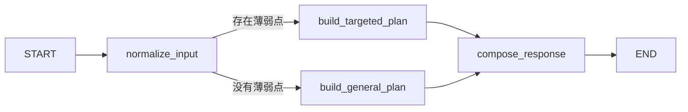

# K12 Agent Runtime

`k12-agent-runtime` 是平台内部的 Python AI 执行服务。它负责智能体编排、模型调用、
RAG、工具调用、异步任务消费，以及未来隔离代码沙箱产生的图表和文件。

## 分层结构

```text
src/k12_agent_runtime/
├── core/                   # 环境配置、日志等横切能力
├── bootstrap/              # 依赖装配，不放业务逻辑
├── domain/                 # Agent、产物、沙箱领域模型和端口
├── application/            # 运行Agent、执行代码等用例
├── infrastructure/         # Agent框架、RabbitMQ、存储、沙箱适配器
├── interfaces/api/         # FastAPI路由和HTTP Schema
├── workers/                # RabbitMQ等独立进程入口
└── main.py                 # FastAPI进程入口
```

依赖方向必须保持：

```text
interfaces/infrastructure -> application -> domain
```

`domain` 不允许导入 FastAPI、RabbitMQ、数据库SDK或具体Agent框架。

## 初始化

```powershell
Set-Location D:\CodeWorkPlace\k12\ai-services\k12-agent-runtime
Copy-Item .env.example .env
uv sync --dev
```

本地 `.env` 不提交Git。配置项统一使用 `K12_AGENT_` 前缀。

## 启动FastAPI

```powershell
uv run k12-agent-runtime
```

需要开发热重载时使用：

```powershell
uv run fastapi dev --host 127.0.0.1 --port 8090
```

默认地址：

- 服务：<http://127.0.0.1:8090>
- Swagger：<http://127.0.0.1:8090/docs>
- 健康检查：<http://127.0.0.1:8090/internal/v1/health>

当前提供的内部接口：

```text
GET  /internal/v1/health
GET  /internal/v1/agents
POST /internal/v1/agents/{agentCode}/invoke
GET  /internal/v1/sandbox/capabilities
POST /internal/v1/sandbox/executions
```

## 示例Agent

`study-plan` 是一个可直接调用的LangGraph学习计划示例，代码位于：

```text
src/k12_agent_runtime/infrastructure/agents/study_plan/
├── state.py   # 定义LangGraph共享状态
├── nodes.py   # 节点、条件路由和确定性示例逻辑
├── graph.py   # 添加节点、连接边并编译图
└── agent.py   # 适配K12 AgentExecutor和统一返回结果
```

执行图：



该示例演示Agent输入、共享State、普通节点、条件边、图编译、异步执行、表格产物和元数据，
当前不依赖外部大模型。后续接入模型时，优先替换计划生成节点，不修改Controller和领域
协议。

请求示例：

```http
POST /internal/v1/agents/study-plan/invoke
Content-Type: application/json

{
  "inputText": "初中数学一次函数",
  "context": {
    "grade": "八年级",
    "durationMinutes": 60,
    "weakPoints": ["函数图像", "斜率"]
  }
}
```

新增Agent时，实现 `AgentExecutor` 协议并在 `bootstrap/container.py` 的注册器中登记即可。

LangGraph复习顺序：

```text
State -> Node -> Edge -> Conditional Edge -> compile -> ainvoke
```

- `State`：节点共享的数据结构，示例使用 `TypedDict`。
- `Node`：读取State并返回部分State更新的Python函数。
- `Edge`：定义节点执行顺序。
- `Conditional Edge`：根据State动态选择下一节点。
- `compile()`：把构建器编译成可执行图。
- `ainvoke()`：异步执行图，适合FastAPI和异步Worker。

`.env` 配置了 `K12_AGENT_INTERNAL_API_KEY` 后，除健康检查外的内部接口必须携带：

```text
X-Internal-Api-Key: <configured-key>
```

## RabbitMQ Worker

先按照 `deploy/rabbitmq/README.md` 启动本地RabbitMQ，然后在本模块 `.env` 中配置：

```dotenv
K12_AGENT_RABBITMQ_ENABLED=true
K12_AGENT_RABBITMQ_URL=amqp://k12:<password>@127.0.0.1:5672/k12
```

启动独立消费者：

```powershell
uv run k12-agent-worker
```

消息拓扑：

```text
Exchange: k12.agent
Request queue: k12.agent.run.request
Result queue: k12.agent.run.result
Dead-letter exchange: k12.agent.dlx
Dead-letter queue: k12.agent.run.dead
```

请求队列和结果队列都绑定同一个死信交换机。Java 与 Python 对同名队列的 durable、
dead-letter-exchange 等声明必须完全一致，否则 RabbitMQ 会拒绝启动并报告
`PRECONDITION_FAILED inequivalent arg`。

## 图表与文件产物

Agent输出使用统一 `artifacts` 数组。当前 `demo-chart` 返回 Vega-Lite JSON：

```json
{
  "kind": "CHART",
  "mimeType": "application/vnd.vegalite.v5+json",
  "payload": {}
}
```

后续图片、CSV、Notebook等大文件上传MinIO，只在 `uri` 中返回对象地址，不能把大文件
Base64直接塞进RabbitMQ消息或普通API响应。

## 代码沙箱安全边界

当前沙箱接口已预留，但默认返回503，且不会执行用户代码。正式实现采用腾讯云Agent
Sandbox（AGSX），由基础设施适配器创建短生命周期实例，并至少满足：默认禁网、临时工作
目录、CPU和内存限制、执行超时、固定依赖镜像以及输出大小限制。禁止在FastAPI或
RabbitMQ Worker主进程中调用 `exec`、`eval` 或 `subprocess` 直接执行前端代码。

详细设计见 [`docs/architecture.md`](docs/architecture.md)。

腾讯云AGSX现行架构、Piston本地边界、Rust静态审查边界以及E2B等备选资源见
[`docs/code-sandbox-platform-guide.md`](docs/code-sandbox-platform-guide.md)。

## 质量检查

```powershell
uv run ruff check .
uv run pytest
```
