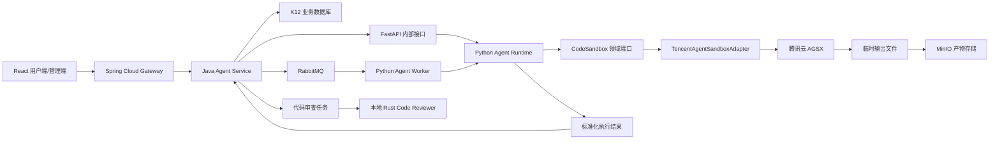

# K12 代码沙箱平台方案

本文统一 K12 项目代码沙箱的架构、平台选择、调用边界、安全要求和实施步骤。当前方案只
选择一家云沙箱厂商，不同时接入多家云服务。

## 1. 当前决策

K12 采用以下分工：

```text
腾讯云 Agent Sandbox（AGSX） = 正式的云端代码执行环境
本地 Piston                    = 开发验证和断网备用，不作为生产云服务
本地 Rust Code Reviewer        = 静态代码审查，不执行用户代码
MinIO                           = 图表和文件产物的长期存储
RabbitMQ                        = 长任务异步调度
```

当前不引入 Judge0，也不同时接入阿里云 AgentBay、火山引擎 Code Sandbox 或 E2B。保留
这些平台的资料，是为了后续重新选型时有依据，不代表当前系统需要实现对应适配器。

### 1.1 任务归属

| 任务 | 当前实现方式 |
| --- | --- |
| Python 数据处理、科学计算 | 腾讯云 AGSX |
| Matplotlib 图表生成 | 腾讯云 AGSX，产物转存 MinIO |
| CSV、Excel、图片等文件生成 | 腾讯云 AGSX，产物转存 MinIO |
| 本地 Python 沙箱验证 | Piston |
| Rust、Java、Python、JS/TS 静态审查 | 本地 Rust Code Reviewer 及固定分析器 |
| 正式编程题判题 | 当前不建设；出现明确业务需求后重新评审 |

Rust Code Reviewer 只做语法树、规则、Lint 和类型诊断等静态分析。它不是代码沙箱，也不
负责运行用户提交的 Python、Java、Rust 或 JavaScript 程序。

## 2. 为什么选择腾讯云 AGSX

腾讯云 AGSX 与当前项目最匹配的原因：

1. 项目已有腾讯云资源，账号、网络、账单和运维入口可以集中管理。
2. 提供代码执行、命令执行、文件读写、自定义镜像和生命周期管理能力。
3. 兼容 E2B API 和 `e2b-code-interpreter` SDK，降低接口锁定和未来迁移成本。
4. 按 CPU、内存和使用时长计费，适合比赛项目的短任务模式。
5. 支持 API Key、配额、超时和网络策略，可由 Agent Runtime 统一控制。

平台不是因为“功能最多”而被选择，而是因为它覆盖当前 Python Agent 代码执行需求，同时
保留较清晰的迁移边界。

## 3. 为什么当前不选择其他平台

### 3.1 阿里云 AgentBay

AgentBay 支持代码、Linux、Windows、浏览器和移动环境，更适合云电脑、Computer Use、
浏览器自动化和移动端 Agent。它不是能力不足，而是当前 K12 主要需要 Python 数据分析、
图表和文件生成，这些能力 AGSX 已经覆盖。

AgentBay 使用自己的 SDK 和计费体系；自定义镜像属于更高级的付费能力。为了避免同时维护
两套密钥、SDK、账单、监控和故障处理流程，当前不接入 AgentBay。

如果未来项目整体迁移到阿里云，或者云桌面、云浏览器、云手机成为核心能力，应重新进行
一次完整平台评审，而不是在现有系统中临时增加第二家云沙箱。

### 3.2 E2B

E2B 是成熟的 Agent 沙箱选型参考，支持代码解释器、自定义模板、文件系统、命令和长会话。
当前不直接使用它，主要考虑国内网络链路、数据出境、账单管理和比赛演示稳定性。

AGSX 兼容 E2B SDK，因此领域接口可以参考 E2B 的会话、命令、文件和代码执行模型，但业务
代码不能直接依赖 E2B 返回对象。未来迁移时应只替换基础设施适配器和配置。

### 3.3 火山引擎 Code Sandbox

火山引擎 Code Sandbox 与豆包、方舟和 AgentKit 集成紧密，适合以火山引擎为主要 AI
平台的项目。K12 当前没有采用这套云平台作为统一基础设施，因此不增加相应依赖。

### 3.4 Piston

Piston 继续保留在本地开发环境，用于验证沙箱调用、基础 Python 输出和断网演示。它不再
承担正式云执行平台职责，也不用于 Java/Rust 静态代码审查。

### 3.5 Judge0

Judge0 的核心价值是测试用例、标准输出比对、时间和内存限制、Accepted/Wrong Answer 等
在线判题语义。当前项目没有确定的 OJ 业务，因此不部署、不开发 `Judge0CodeJudge`，也不
预先增加 Judge0 的 Redis、PostgreSQL 和 Worker。

后续如果明确建设编程作业自动判题，再单独编写判题架构方案，不能把 Judge0 当作 AGSX
的普通故障备用。

## 4. 系统架构



### 4.1 控制面

Spring Cloud Gateway 和 Java 服务负责：

- JWT 认证、RBAC 权限检查和接口限流。
- 校验语言、代码长度、超时和任务类型。
- 创建平台自己的 `executionId`，并保存任务状态。
- 控制用户配额、幂等、取消、重试和审计。
- 向前端提供统一 API，不暴露云厂商地址和 API Key。

### 4.2 执行面

Python Agent Runtime 和 Worker 负责：

- 将平台请求转换成 `CodeSandbox` 领域请求。
- 通过腾讯云适配器创建、使用并销毁沙箱实例。
- 标准化 stdout、stderr、退出状态、耗时和产物。
- 将图片、CSV、Excel 等文件上传 MinIO。
- 返回平台产物 URI，不返回云厂商临时下载地址作为永久地址。

### 4.3 静态审查面

本地 Rust Code Reviewer 与云沙箱分离：

- 通过固定 CLI 和 JSON 协议被 Python Worker 调用。
- 使用固定规则、Tree-sitter、Ruff、Bandit、ESLint、Checkstyle 等受控分析器。
- 禁止读取用户提供的可执行插件和配置。
- 禁止运行用户代码、构建脚本、过程宏或注解处理器。

## 5. 代码接口边界

业务层继续依赖项目自己的 `CodeSandbox` 端口：

```python
class CodeSandbox(Protocol):
    async def execute(
        self,
        request: CodeExecutionRequest,
    ) -> CodeExecutionResult: ...
```

当前基础设施实现：

```text
CodeSandbox
    -> DisabledCodeSandbox          默认关闭时返回明确错误
    -> TencentAgentSandboxAdapter   正式云执行实现
    -> PistonCodeSandbox            显式本地开发和断网演示实现
```

供应商对象仅存在于基础设施层，不会进入Controller、用例层或领域模型。云端失败不会静默
切换Piston；需要断网演示时必须在启动前显式修改`K12_AGENT_SANDBOX_PROVIDER`。

统一请求至少包含：

```text
executionId
language
sourceCode
timeoutSeconds
artifactRequirements
```

统一结果至少包含：

```text
executionId
status
stdout
stderr
exitCode
durationMs
artifacts
providerRequestId
```

`providerRequestId` 只用于审计和故障定位，不能作为 K12 业务主键。

## 6. 执行流程

### 6.1 短任务

```text
1. 前端请求 Gateway。
2. Java 服务完成认证、授权、限流和参数校验。
3. Java 创建平台 runId 和 RUNNING 记录。
4. Java 通过内部 FastAPI 调用 Agent Runtime。
5. Runtime 通过腾讯云适配器创建 AGSX 实例。
6. 适配器上传代码和输入文件，执行受限 Python 代码。
7. Runtime 收集输出，将产物上传 MinIO。
8. 适配器在 finally 中销毁沙箱实例。
9. Java 用短事务更新最终状态、写入Artifact并向前端返回统一结果。
```

### 6.2 长任务

```text
1. Java 创建 executionId，状态设为 QUEUED。
2. Java 将任务发送到 RabbitMQ。
3. Python Worker 消费消息并调用同一个执行用例。
4. 执行结果发送到结果队列。
5. Java 消费结果，更新数据库并触发通知。
```

同步和异步入口必须复用同一个应用用例，不能形成两套沙箱调用逻辑。

## 7. 沙箱环境建议

比赛阶段只维护一个受控 Python 镜像：

```text
Python 3.12
numpy
pandas
matplotlib
openpyxl
scipy
scikit-learn
pillow
```

依赖版本必须由团队锁定。用户不能通过请求任意执行 `pip install`，也不能上传
`requirements.txt` 后自动安装。确需增加依赖时，应修改镜像、执行安全检查并重新发布。

初始资源建议：

```yaml
cpu: 1
memory: 2GiB
timeoutSeconds: 60
maxOutputBytes: 1048576
maxArtifactBytes: 20971520
maxConcurrency: 5
networkPolicy: deny-by-default
```

参数最终以腾讯云控制台、配额和压测结果为准。沙箱地域应与 Agent Runtime 部署地域一致，
不要在代码中写死广州、上海或北京。

## 8. 安全要求

- React 前端不能直接调用 AGSX。
- API Key 只能由 Python Runtime 通过环境变量或密钥管理服务读取。
- API Key、用户源码和敏感输出不能提交 Git 或完整写入日志。
- 默认禁止沙箱访问互联网；确需联网时按任务配置域名白名单。
- 禁止把数据库、Nacos、RabbitMQ、MinIO 管理端口暴露给沙箱。
- 设置 CPU、内存、进程数、文件大小、输出大小和执行时间限制。
- 每次请求使用独立工作目录，结束后销毁实例。
- 用户代码不能继承 Agent Runtime 的环境变量、云凭证和内网权限。
- 产物上传 MinIO 前检查类型、扩展名、大小和路径。
- 失败、超时和取消路径同样必须执行实例回收。

推荐配置名称：

```dotenv
K12_AGENT_SANDBOX_ENABLED=true
K12_AGENT_SANDBOX_PROVIDER=tencent_agsx
K12_AGENT_SANDBOX_TEMPLATE=k12-python-analysis-v1
K12_AGENT_SANDBOX_TIMEOUT_SECONDS=60
K12_AGENT_SANDBOX_MAX_CONCURRENCY=5
E2B_DOMAIN=<same-region-tencent-agsx-domain>
E2B_API_KEY=<secret>
```

`.env.example` 只能保留占位符，不能提供真实密钥。

## 9. 状态和错误映射

平台保存自己的状态，不直接保存云厂商枚举作为业务状态：

```text
PENDING -> QUEUED -> RUNNING -> SUCCEEDED
                            -> FAILED
                            -> TIMED_OUT
                            -> CANCELLED
                            -> REJECTED
```

至少区分以下错误：

```text
INVALID_REQUEST
SANDBOX_UNAVAILABLE
SANDBOX_CREATE_FAILED
EXECUTION_TIMED_OUT
OUTPUT_LIMIT_EXCEEDED
ARTIFACT_UPLOAD_FAILED
PROVIDER_RATE_LIMITED
INTERNAL_ERROR
```

只有明确的瞬时错误可以有限重试。语法错误、用户代码异常、超时和资源超限不能自动无限
重试。

## 10. 成本和稳定性控制

- AGSX 实例必须按任务创建、按任务销毁，禁止比赛阶段保持 7x24 小时常驻。
- 在 `finally` 和后台补偿任务中都实现实例回收。
- Java公开入口按用户设置日配额，启用后的默认值为5次/日；每个Runtime进程的每种沙箱适配器分别限制同时执行数与
  最多等待人数，排队超过
  `K12_AGENT_SANDBOX_QUEUE_WAIT_SECONDS`或`K12_AGENT_SANDBOX_MAX_WAITERS`即返回`REJECTED`，
  不创建新实例，也不切换备用沙箱。每种适配器默认并发2、最多等待4个、等待3秒；主备
  同时工作时各自占用名额，这不是跨进程或跨机器的统一限流。
- 配置硬上限为并发4、等待8、等待5秒；范围、离线压测命令和真实环境验收步骤见
  [代码沙箱容量与压测手册](code-sandbox-load-test-guide.md)。
- 单用户/班级的实时并发名额及跨实例系统上限仍待设计，不能把当前进程内信号量当成全局配额。
- 记录执行时长、CPU/内存规格、失败原因和估算费用。
- 配置腾讯云预算告警、余额告警和 API 调用告警。
- RabbitMQ 只传输任务元数据，小文件以外的内容通过 MinIO 传递。
- 云服务故障时允许按配置降级到独立Piston容器，不能在主进程直接执行代码兜底。
- 降级只捕获供应商不可用异常；语法错误、用户代码异常、超时和资源超限不得重复执行。
- 只有云沙箱尚未返回实例、用户代码尚未提交时的创建故障才能自动切换Piston。实例已创建后若
  运行请求或产物存储失败，代码是否执行成功可能未知，必须禁止自动重放；同步接口返回脱敏503，
  异步任务记录失败，由用户确认后另起一次运行。
- 主执行器失败后进入短暂冷却期，避免每次请求都等待同一个云端超时。
- 云供应商控制面请求默认30秒超时，给Java 90秒整体读取窗口预留执行和本地降级时间。

## 11. 分阶段实施

### 阶段一：平台验证

1. 在腾讯云控制台创建 API Key 和代码沙箱工具。
2. 建立固定 Python 镜像，验证 NumPy、Pandas、Matplotlib 和文件导出。
3. 验证超时、输出限制、网络策略、文件上传和实例销毁。
4. 记录单任务耗时和费用，确定比赛配额。

### 阶段二：Runtime 接入（适配层已完成）

1. 已在`infrastructure/sandbox/`实现腾讯云与Piston适配器。
2. 已增加显式主备供应商配置，在`bootstrap/container.py`装配，并通过冷却时间控制云端重试。
3. FastAPI接口和领域模型不暴露厂商SDK对象。
4. 已完成无网络单元测试；受控云集成测试仍需使用团队配额执行。

### 阶段三：异步和产物闭环

1. 已完成Java内部Feign契约、`CodeExecutionService`和同步公开Controller。
2. Runtime已支持将腾讯云返回的PNG、JPEG和PDF二进制产物转存MinIO。
3. Java已用`agent_run`保存平台runId、JWT用户归属、状态和脱敏审计元数据，并用
   `agent_artifact`保存代码执行产物。
4. 已增加`k12.code.execute.request`和`k12.code.execute.result`专用队列以及独立消息DTO；
   Python Worker复用`ExecuteCodeUseCase`，Java消费者负责RUNNING通知、终态幂等和产物持久化。
5. 同一公开接口通过`executionMode=SYNC|ASYNC`切换；异步首次返回HTTP 202和`PENDING`。
6. Gateway通配路由和OpenAPI已完成，待实现前端运行状态、错误、图表和文件展示。

前端代码编辑器和后端基础链路已经完成。2026-09-16真实联调确认内部API密钥已生效，但腾讯云
创建沙箱实例发生读取超时；当前阶段增加本地Piston自动保底，随后进行主备真实HTTP联调和
恶意代码安全验收。

2026-09-16回归结果：Backend完整Maven反应堆7个模块共138个测试通过，Python Runtime Ruff
检查和58个测试通过；OpenAPI JSON解析通过。

同日主备联调结果：在Codex工具沙箱内，创建腾讯云实例的请求超时，降级后Gateway ->
Java Agent Service -> Python Runtime -> Piston链路返回`200/SUCCEEDED`，首次约15.97秒，
冷却期内再次请求约0.96秒。审计运行编号为`6312ddad-4d07-4370-b961-6914615e4f12`。
随后在工具沙箱外重测，腾讯云创建实例并运行`print`成功，约6.7秒，结果执行器确认为
`tencent_agsx`。因此前述超时应归因于该次工具沙箱的出站网络限制，不代表腾讯云服务故障。
后续排查发现`8090`一直被上轮在Codex受限工具沙箱内启动的旧Runtime占用，因此新的正常网络
进程无法绑定端口。停止该旧进程后，从正常网络启动Runtime，内部HTTP接口返回
`tencent_agsx/SUCCEEDED`。Gateway到腾讯云的同步请求用10秒代码执行上限时，云实例创建成功，
但解释器首次执行超时；改用30秒上限后返回`SUCCEEDED`，运行编号为
`f5cc8cde-235d-489e-87ac-cb8aa4ef6366`。因此把学生代码默认上限设为30秒、供应商创建
请求预算设为30秒、Java调用Runtime读取预算设为90秒。此上限仍受供应商及镜像限制；正式部署
需要在宿主机或具备腾讯云出站权限的网络中启动Runtime，不能通过业务代码绕过工具沙箱限制。
使用最终`.env`从仓库根目录启动Runtime后再次走Gateway同步接口，约5.6秒返回
`200/SUCCEEDED`，产物供应商为`tencent_agsx`，运行编号
`f8a1c8a5-5d65-4f19-a227-d3ab107d37ea`；用运行详情接口查询持久化状态同样为`SUCCEEDED`。
本地`.env`已开启腾讯云主执行器；`.env.example`仍默认关闭，避免团队成员无意触发付费调用。
前端代码实验页默认异步模式还依赖RabbitMQ Worker。正常网络环境启动Worker后，经Gateway
提交异步代码执行，运行编号`852c3497-8c23-47df-8b43-1d3e43c15127`从`PENDING`收敛为
`SUCCEEDED`，产物供应商确认为`tencent_agsx`。只启动HTTP Runtime而不启动Worker不能完成
异步任务。

2026-09-16真实文件验收：通过`tests/test_minio_live.py`向已配置的MinIO上传随机小文件，
签发短期地址、下载并逐字节校验后清理测试对象。随后经Gateway提交云沙箱的极小PNG显示代码，
运行`c431ff94-d72e-4af7-95d5-31f4d79f53e1`返回`SUCCEEDED`，保存了`CODE_RESULT`
与`IMAGE`产物；运行详情回显`IMAGE`的`s3://`地址，按运行归属签发的900秒URL下载返回
HTTP 200和有效PNG。未登录取地址返回401，不存在的运行返回404；跨用户访问由Java
`AgentArtifactAccessServiceTest`覆盖，本轮没有新建测试用户。先前一次`matplotlib`绘图运行
`7705c42c-fc9d-4ae3-a935-2c55317de937`在30秒代码上限内超时，不能据此认为复杂图表
已完成云端验收。

后续使用`scripts/probe_cloud_chart.py`分段复测：实例创建约2.9-3.6秒、解释器预热约
2.3-3.2秒、`matplotlib`导入约0.4秒；导入并非这次超时的主要瓶颈。直接`display(fig)`
虽然很快结束，但SDK没有返回PNG。使用无界面`Agg`后，先保存到`BytesIO`，再通过
`display(Image(data=buffer.getvalue()))`输出，可在约1.3秒内得到PNG。相同写法经
Gateway同步执行，运行`7d3eadf4-83ad-4b1c-b024-a7efc8ac5be6`约4.7秒成功，返回
`CODE_RESULT`和`IMAGE`，MinIO短链下载HTTP 200，文件6419字节。原`plt.show()`超时
是否由默认交互后端或偶发供应商延迟造成尚未单独证实；当前演示采用已验证的显式PNG写法，
不扩大所有学生代码的30秒限制。

绘图代码的关键部分：

```python
import matplotlib
matplotlib.use("Agg", force=True)
import matplotlib.pyplot as plt
from io import BytesIO
from IPython.display import Image, display

fig, ax = plt.subplots()
ax.plot([1, 2, 3], [2, 4, 3])
buffer = BytesIO()
fig.savefig(buffer, format="png")
display(Image(data=buffer.getvalue()))
plt.close(fig)
```

探针只供手动运行，会创建并销毁云实例、产生少量费用；不属于默认测试集：

```powershell
cd ai-services/k12-agent-runtime
.\.venv\Scripts\python.exe scripts/probe_cloud_chart.py
```

MinIO回环测试默认跳过；只有团队共享存储允许写入和清理时才手动启用：

```powershell
cd ai-services/k12-agent-runtime
$env:K12_RUN_LIVE_MINIO_TEST = "1"
.\.venv\Scripts\python.exe -m pytest tests/test_minio_live.py -q
Remove-Item Env:K12_RUN_LIVE_MINIO_TEST
```

测试读取本模块`.env`，不输出对象存储密钥或签名URL。Gateway云执行需另行启动Java服务
和正常网络环境的Python Runtime，会产生云沙箱调用费用并保留运行审计记录。

### 阶段四：加固

1. 已完成第一批主备故障边界加固：创建失败仍可降级；云实例创建后运行结果不确定或产物存储失败
   不再切换供应商重放，同步返回受控错误，实例在`finally`中尽力销毁。无网络回归覆盖两种故障、
   正常降级及超时不重放；这不是云端恶意代码隔离能力验收。
2. 第二批增加云端结果项、文件数量及累计文件字节上限，默认分别为20项、5个、20MB。
   超限不解码或转存文件，返回`REJECTED`，并禁止主备重放；标准输出超限也不转存文件。
   单元测试使用假沙箱；限制在Runtime收到供应商响应后生效，不能替代云端镜像、执行资源、
   网络及响应体配额验收，也不代表计费配额已配置。
3. Java公开代码入口的单用户日配额已完成；跨进程总并发、取消、补偿回收和费用告警仍待完成。
4. 待建立恶意代码、死循环、路径穿越和网络探测的隔离测试集，并在受控环境验收。
5. 定期复核 SDK、镜像、依赖版本和腾讯云产品变更。

## 12. 资源与备选方案

以下资料全部保留用于团队学习、部署维护和后续重新选型。

### 12.1 当前采用：腾讯云 AGSX

- [Agent Sandbox 产品页](https://cloud.tencent.com/product/agsx)
- [Agent Runtime 快速入门](https://cloud.tencent.com/document/product/1814/123816)
- [创建自定义代码解释器沙箱](https://cloud.tencent.com/document/product/1814/129691)
- [Agent Sandbox 计费模式](https://cloud.tencent.com/document/product/1814/133249)
- [Agent Sandbox 配额](https://cloud.tencent.com/document/product/1814/123815)
- [Agent Sandbox 服务等级协议](https://cloud.tencent.com/document/product/301/133536)

### 12.2 国内备选平台

- [阿里云 AgentBay](https://help.aliyun.com/zh/agentbay/)
- [AgentBay 核心概念](https://help.aliyun.com/zh/agentbay/developer-reference/core-concept)
- [AgentBay 计费说明](https://help.aliyun.com/zh/agentbay/product-overview/agentbay-billing-instructions)
- [火山引擎 AgentKit 与 Code Sandbox](https://www.volcengine.com/solutions/ai-cloud-native-agentkit)
- [火山引擎 Code Sandbox Agent](https://www.volcengine.com/docs/6662/1779212)

### 12.3 Agent 沙箱选型参考

- [E2B 官方文档](https://e2b.dev/docs)
- [E2B GitHub](https://github.com/e2b-dev/e2b)
- [E2B 自定义模板](https://e2b.dev/docs/template/quickstart)
- [E2B BYOC](https://e2b.dev/docs/byoc)
- [OpenSandbox GitHub](https://github.com/opensandbox-group/OpenSandbox)
- [AI Sandbox 资源列表](https://github.com/restyler/awesome-sandbox)

### 12.4 本地执行与判题参考

- [Piston GitHub](https://github.com/engineer-man/piston)
- [Piston 官方文档](https://piston.readthedocs.io/)
- [K12 Piston 本地部署文档](../../../deploy/piston/README.md)
- [Judge0 GitHub](https://github.com/judge0/judge0)
- [Judge0 官方论文](https://paper.judge0.com/)

Judge0 仅作为未来出现正式 OJ 需求时的判题参考，不属于当前实施计划。

### 12.5 底层隔离与安全参考

- [Isolate](https://github.com/ioi/isolate)
- [nsjail](https://github.com/google/nsjail)
- [gVisor](https://gvisor.dev/docs/user_guide/install/)
- [Firecracker](https://firecracker-microvm.github.io/)
- [Kata Containers](https://katacontainers.io/)
- [Docker Engine 安全](https://docs.docker.com/engine/security/)
- [Docker Rootless 模式](https://docs.docker.com/engine/security/rootless/)
- [Docker Seccomp](https://docs.docker.com/engine/security/seccomp/)
- [Docker none 网络](https://docs.docker.com/engine/network/drivers/none/)
- [Docker Daemon Socket 防护](https://docs.docker.com/engine/security/protect-access/)

## 13. 团队决策摘要

```text
云厂商：只采用腾讯云 AGSX，不并行接入多家云沙箱。
执行：AGSX 负责正式 Python 代码执行、数据分析和文件生成。
本地：Piston 只用于开发验证和断网演示。
审查：本地 Rust Code Reviewer 负责静态审查，不归属云沙箱。
判题：Judge0 不进入当前计划，出现正式 OJ 需求后重新评审。
接口：业务层只依赖 CodeSandbox，腾讯云 SDK 只能出现在基础设施层。
产物：云沙箱是临时环境，图片和文件必须转存 MinIO。
安全：前端不接触云密钥，用户代码不能访问 Runtime 凭证和内部网络。
```
