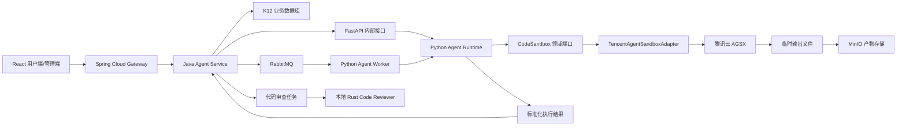

# K12 代码沙箱平台方案

本文统一 K12 项目代码沙箱的架构、平台选择、调用边界、安全要求和实施步骤。当前方案只
选择一家云沙箱厂商，不同时接入多家云服务。

## 1. 当前决策

K12 采用以下分工：

```text
腾讯云 Agent Sandbox（AGSX） = 正式的云端代码执行环境
本地 Piston                    = 开发验证和断网备用，不作为生产云服务
本地 Rust Code Reviewer        = 静态代码审查，不执行用户代码
MinIO                           = 图表和文件产物的长期存储
RabbitMQ                        = 长任务异步调度
```

当前不引入 Judge0，也不同时接入阿里云 AgentBay、火山引擎 Code Sandbox 或 E2B。保留
这些平台的资料，是为了后续重新选型时有依据，不代表当前系统需要实现对应适配器。

### 1.1 任务归属

| 任务 | 当前实现方式 |
| --- | --- |
| Python 数据处理、科学计算 | 腾讯云 AGSX |
| Matplotlib 图表生成 | 腾讯云 AGSX，产物转存 MinIO |
| CSV、Excel、图片等文件生成 | 腾讯云 AGSX，产物转存 MinIO |
| 本地 Python 沙箱验证 | Piston |
| Rust、Java、Python、JS/TS 静态审查 | 本地 Rust Code Reviewer 及固定分析器 |
| 正式编程题判题 | 当前不建设；出现明确业务需求后重新评审 |

Rust Code Reviewer 只做语法树、规则、Lint 和类型诊断等静态分析。它不是代码沙箱，也不
负责运行用户提交的 Python、Java、Rust 或 JavaScript 程序。

## 2. 为什么选择腾讯云 AGSX

腾讯云 AGSX 与当前项目最匹配的原因：

1. 项目已有腾讯云资源，账号、网络、账单和运维入口可以集中管理。
2. 提供代码执行、命令执行、文件读写、自定义镜像和生命周期管理能力。
3. 兼容 E2B API 和 `e2b-code-interpreter` SDK，降低接口锁定和未来迁移成本。
4. 按 CPU、内存和使用时长计费，适合比赛项目的短任务模式。
5. 支持 API Key、配额、超时和网络策略，可由 Agent Runtime 统一控制。

平台不是因为“功能最多”而被选择，而是因为它覆盖当前 Python Agent 代码执行需求，同时
保留较清晰的迁移边界。

## 3. 为什么当前不选择其他平台

### 3.1 阿里云 AgentBay

AgentBay 支持代码、Linux、Windows、浏览器和移动环境，更适合云电脑、Computer Use、
浏览器自动化和移动端 Agent。它不是能力不足，而是当前 K12 主要需要 Python 数据分析、
图表和文件生成，这些能力 AGSX 已经覆盖。

AgentBay 使用自己的 SDK 和计费体系；自定义镜像属于更高级的付费能力。为了避免同时维护
两套密钥、SDK、账单、监控和故障处理流程，当前不接入 AgentBay。

如果未来项目整体迁移到阿里云，或者云桌面、云浏览器、云手机成为核心能力，应重新进行
一次完整平台评审，而不是在现有系统中临时增加第二家云沙箱。

### 3.2 E2B

E2B 是成熟的 Agent 沙箱选型参考，支持代码解释器、自定义模板、文件系统、命令和长会话。
当前不直接使用它，主要考虑国内网络链路、数据出境、账单管理和比赛演示稳定性。

AGSX 兼容 E2B SDK，因此领域接口可以参考 E2B 的会话、命令、文件和代码执行模型，但业务
代码不能直接依赖 E2B 返回对象。未来迁移时应只替换基础设施适配器和配置。

### 3.3 火山引擎 Code Sandbox

火山引擎 Code Sandbox 与豆包、方舟和 AgentKit 集成紧密，适合以火山引擎为主要 AI
平台的项目。K12 当前没有采用这套云平台作为统一基础设施，因此不增加相应依赖。

### 3.4 Piston

Piston 继续保留在本地开发环境，用于验证沙箱调用、基础 Python 输出和断网演示。它不再
承担正式云执行平台职责，也不用于 Java/Rust 静态代码审查。

### 3.5 Judge0

Judge0 的核心价值是测试用例、标准输出比对、时间和内存限制、Accepted/Wrong Answer 等
在线判题语义。当前项目没有确定的 OJ 业务，因此不部署、不开发 `Judge0CodeJudge`，也不
预先增加 Judge0 的 Redis、PostgreSQL 和 Worker。

后续如果明确建设编程作业自动判题，再单独编写判题架构方案，不能把 Judge0 当作 AGSX
的普通故障备用。

## 4. 系统架构



### 4.1 控制面

Spring Cloud Gateway 和 Java 服务负责：

- JWT 认证、RBAC 权限检查和接口限流。
- 校验语言、代码长度、超时和任务类型。
- 创建平台自己的 `executionId`，并保存任务状态。
- 控制用户配额、幂等、取消、重试和审计。
- 向前端提供统一 API，不暴露云厂商地址和 API Key。

### 4.2 执行面

Python Agent Runtime 和 Worker 负责：

- 将平台请求转换成 `CodeSandbox` 领域请求。
- 通过腾讯云适配器创建、使用并销毁沙箱实例。
- 标准化 stdout、stderr、退出状态、耗时和产物。
- 将图片、CSV、Excel 等文件上传 MinIO。
- 返回平台产物 URI，不返回云厂商临时下载地址作为永久地址。

### 4.3 静态审查面

本地 Rust Code Reviewer 与云沙箱分离：

- 通过固定 CLI 和 JSON 协议被 Python Worker 调用。
- 使用固定规则、Tree-sitter、Ruff、Bandit、ESLint、Checkstyle 等受控分析器。
- 禁止读取用户提供的可执行插件和配置。
- 禁止运行用户代码、构建脚本、过程宏或注解处理器。

## 5. 代码接口边界

业务层继续依赖项目自己的 `CodeSandbox` 端口：

```python
class CodeSandbox(Protocol):
    async def execute(
        self,
        request: CodeExecutionRequest,
    ) -> CodeExecutionResult: ...
```

当前基础设施实现规划：

```text
CodeSandbox
    -> DisabledCodeSandbox          当前未启用时返回明确错误
    -> TencentAgentSandboxAdapter   正式云执行实现
```

Piston 调试代码放在部署和集成测试边界，不要让 Controller、用例层或领域模型出现腾讯云、
E2B、Piston 的请求对象。

统一请求至少包含：

```text
executionId
language
sourceCode
timeoutSeconds
artifactRequirements
```

统一结果至少包含：

```text
executionId
status
stdout
stderr
exitCode
durationMs
artifacts
providerRequestId
```

`providerRequestId` 只用于审计和故障定位，不能作为 K12 业务主键。

## 6. 执行流程

### 6.1 短任务

```text
1. 前端请求 Gateway。
2. Java 服务完成认证、授权、限流和参数校验。
3. Java 创建 executionId 和 PENDING 记录。
4. Java 通过内部 FastAPI 调用 Agent Runtime。
5. Runtime 通过腾讯云适配器创建 AGSX 实例。
6. 适配器上传代码和输入文件，执行受限 Python 代码。
7. Runtime 收集输出，将产物上传 MinIO。
8. 适配器在 finally 中销毁沙箱实例。
9. Java 更新最终状态并向前端返回统一结果。
```

### 6.2 长任务

```text
1. Java 创建 executionId，状态设为 QUEUED。
2. Java 将任务发送到 RabbitMQ。
3. Python Worker 消费消息并调用同一个执行用例。
4. 执行结果发送到结果队列。
5. Java 消费结果，更新数据库并触发通知。
```

同步和异步入口必须复用同一个应用用例，不能形成两套沙箱调用逻辑。

## 7. 沙箱环境建议

比赛阶段只维护一个受控 Python 镜像：

```text
Python 3.12
numpy
pandas
matplotlib
openpyxl
scipy
scikit-learn
pillow
```

依赖版本必须由团队锁定。用户不能通过请求任意执行 `pip install`，也不能上传
`requirements.txt` 后自动安装。确需增加依赖时，应修改镜像、执行安全检查并重新发布。

初始资源建议：

```yaml
cpu: 1
memory: 2GiB
timeoutSeconds: 60
maxOutputBytes: 1048576
maxArtifactBytes: 20971520
maxConcurrency: 5
networkPolicy: deny-by-default
```

参数最终以腾讯云控制台、配额和压测结果为准。沙箱地域应与 Agent Runtime 部署地域一致，
不要在代码中写死广州、上海或北京。

## 8. 安全要求

- React 前端不能直接调用 AGSX。
- API Key 只能由 Python Runtime 通过环境变量或密钥管理服务读取。
- API Key、用户源码和敏感输出不能提交 Git 或完整写入日志。
- 默认禁止沙箱访问互联网；确需联网时按任务配置域名白名单。
- 禁止把数据库、Nacos、RabbitMQ、MinIO 管理端口暴露给沙箱。
- 设置 CPU、内存、进程数、文件大小、输出大小和执行时间限制。
- 每次请求使用独立工作目录，结束后销毁实例。
- 用户代码不能继承 Agent Runtime 的环境变量、云凭证和内网权限。
- 产物上传 MinIO 前检查类型、扩展名、大小和路径。
- 失败、超时和取消路径同样必须执行实例回收。

推荐配置名称：

```dotenv
K12_AGENT_SANDBOX_ENABLED=true
K12_AGENT_SANDBOX_PROVIDER=tencent_agsx
K12_AGENT_SANDBOX_TEMPLATE=k12-python-analysis-v1
K12_AGENT_SANDBOX_TIMEOUT_SECONDS=60
K12_AGENT_SANDBOX_MAX_CONCURRENCY=5
E2B_DOMAIN=<same-region-tencent-agsx-domain>
E2B_API_KEY=<secret>
```

`.env.example` 只能保留占位符，不能提供真实密钥。

## 9. 状态和错误映射

平台保存自己的状态，不直接保存云厂商枚举作为业务状态：

```text
PENDING -> QUEUED -> RUNNING -> SUCCEEDED
                            -> FAILED
                            -> TIMED_OUT
                            -> CANCELLED
                            -> REJECTED
```

至少区分以下错误：

```text
INVALID_REQUEST
SANDBOX_UNAVAILABLE
SANDBOX_CREATE_FAILED
EXECUTION_TIMED_OUT
OUTPUT_LIMIT_EXCEEDED
ARTIFACT_UPLOAD_FAILED
PROVIDER_RATE_LIMITED
INTERNAL_ERROR
```

只有明确的瞬时错误可以有限重试。语法错误、用户代码异常、超时和资源超限不能自动无限
重试。

## 10. 成本和稳定性控制

- AGSX 实例必须按任务创建、按任务销毁，禁止比赛阶段保持 7x24 小时常驻。
- 在 `finally` 和后台补偿任务中都实现实例回收。
- 设置单用户、单班级和系统级并发上限。
- 记录执行时长、CPU/内存规格、失败原因和估算费用。
- 配置腾讯云预算告警、余额告警和 API 调用告警。
- RabbitMQ 只传输任务元数据，小文件以外的内容通过 MinIO 传递。
- 云服务故障时返回可识别的“执行服务暂不可用”，不能在主进程直接执行代码兜底。
- 比赛现场需要断网演示时，显式切换本地开发配置，不做运行时静默跨平台降级。

## 11. 分阶段实施

### 阶段一：平台验证

1. 在腾讯云控制台创建 API Key 和代码沙箱工具。
2. 建立固定 Python 镜像，验证 NumPy、Pandas、Matplotlib 和文件导出。
3. 验证超时、输出限制、网络策略、文件上传和实例销毁。
4. 记录单任务耗时和费用，确定比赛配额。

### 阶段二：Runtime 接入

1. 在 `infrastructure/sandbox/` 实现 `TencentAgentSandboxAdapter`。
2. 在 `core/config.py` 增加配置并在 `bootstrap/container.py` 装配。
3. 保持 FastAPI 接口和领域模型不暴露厂商字段。
4. 增加适配器单元测试、契约测试和一个受控云集成测试。

### 阶段三：异步和产物闭环

1. RabbitMQ 增加代码执行请求、结果和死信队列。
2. 接入 MinIO，完成图片、CSV、Excel 的转存和下载授权。
3. Java 服务保存任务状态、产物元数据和审计记录。
4. 前端实现运行状态、错误信息、图表和文件展示。

### 阶段四：加固

1. 增加配额、熔断、重试、取消、补偿回收和费用告警。
2. 建立恶意代码、死循环、输出洪泛、路径穿越和网络探测测试集。
3. 定期复核 SDK、镜像、依赖版本和腾讯云产品变更。

## 12. 资源与备选方案

以下资料全部保留用于团队学习、部署维护和后续重新选型。

### 12.1 当前采用：腾讯云 AGSX

- [Agent Sandbox 产品页](https://cloud.tencent.com/product/agsx)
- [Agent Runtime 快速入门](https://cloud.tencent.com/document/product/1814/123816)
- [创建自定义代码解释器沙箱](https://cloud.tencent.com/document/product/1814/129691)
- [Agent Sandbox 计费模式](https://cloud.tencent.com/document/product/1814/133249)
- [Agent Sandbox 配额](https://cloud.tencent.com/document/product/1814/123815)
- [Agent Sandbox 服务等级协议](https://cloud.tencent.com/document/product/301/133536)

### 12.2 国内备选平台

- [阿里云 AgentBay](https://help.aliyun.com/zh/agentbay/)
- [AgentBay 核心概念](https://help.aliyun.com/zh/agentbay/developer-reference/core-concept)
- [AgentBay 计费说明](https://help.aliyun.com/zh/agentbay/product-overview/agentbay-billing-instructions)
- [火山引擎 AgentKit 与 Code Sandbox](https://www.volcengine.com/solutions/ai-cloud-native-agentkit)
- [火山引擎 Code Sandbox Agent](https://www.volcengine.com/docs/6662/1779212)

### 12.3 Agent 沙箱选型参考

- [E2B 官方文档](https://e2b.dev/docs)
- [E2B GitHub](https://github.com/e2b-dev/e2b)
- [E2B 自定义模板](https://e2b.dev/docs/template/quickstart)
- [E2B BYOC](https://e2b.dev/docs/byoc)
- [OpenSandbox GitHub](https://github.com/opensandbox-group/OpenSandbox)
- [AI Sandbox 资源列表](https://github.com/restyler/awesome-sandbox)

### 12.4 本地执行与判题参考

- [Piston GitHub](https://github.com/engineer-man/piston)
- [Piston 官方文档](https://piston.readthedocs.io/)
- [K12 Piston 本地部署文档](../../../deploy/piston/README.md)
- [Judge0 GitHub](https://github.com/judge0/judge0)
- [Judge0 官方论文](https://paper.judge0.com/)

Judge0 仅作为未来出现正式 OJ 需求时的判题参考，不属于当前实施计划。

### 12.5 底层隔离与安全参考

- [Isolate](https://github.com/ioi/isolate)
- [nsjail](https://github.com/google/nsjail)
- [gVisor](https://gvisor.dev/docs/user_guide/install/)
- [Firecracker](https://firecracker-microvm.github.io/)
- [Kata Containers](https://katacontainers.io/)
- [Docker Engine 安全](https://docs.docker.com/engine/security/)
- [Docker Rootless 模式](https://docs.docker.com/engine/security/rootless/)
- [Docker Seccomp](https://docs.docker.com/engine/security/seccomp/)
- [Docker none 网络](https://docs.docker.com/engine/network/drivers/none/)
- [Docker Daemon Socket 防护](https://docs.docker.com/engine/security/protect-access/)

## 13. 团队决策摘要

```text
云厂商：只采用腾讯云 AGSX，不并行接入多家云沙箱。
执行：AGSX 负责正式 Python 代码执行、数据分析和文件生成。
本地：Piston 只用于开发验证和断网演示。
审查：本地 Rust Code Reviewer 负责静态审查，不归属云沙箱。
判题：Judge0 不进入当前计划，出现正式 OJ 需求后重新评审。
接口：业务层只依赖 CodeSandbox，腾讯云 SDK 只能出现在基础设施层。
产物：云沙箱是临时环境，图片和文件必须转存 MinIO。
安全：前端不接触云密钥，用户代码不能访问 Runtime 凭证和内部网络。
```
