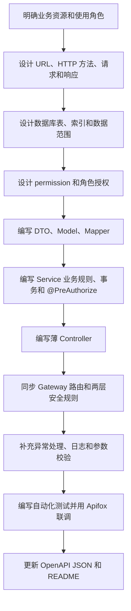

# K12 后续 API 接口开发规范

本文规定 K12 后端新增和修改 API 时必须遵守的工程规范。适用于 `k12-iam-service`、`k12-learning-service`、`k12-agent-service`、`k12-assessment-service` 以及后续新增的业务服务。

本文中的约束级别：

| 级别 | 含义 |
|---|---|
| MUST | 必须遵守，涉及安全、正确性或统一契约 |
| SHOULD | 原则上遵守，确有理由时可以在代码评审中说明 |
| MAY | 可选能力，根据当前业务复杂度决定 |

## 1. 开发总原则

新增 API 必须同时考虑五件事：

```text
接口契约
  + 业务规则
  + 数据访问
  + 认证授权
  + 文档测试
```

不能只创建 Controller 并确认“接口能访问”就算完成。标准开发链路是：



## 2. 模块边界和 URL 前缀

### 2.1 当前模块固定前缀

| 模块 | Gateway 路由前缀 | 默认端口 | 主要职责 |
|---|---|---:|---|
| Gateway | `/api/v1/gateway/**` | 8080 | 健康检查、统一入口和路由 |
| IAM | `/api/v1/iam/**` | 8081 | 登录、用户、角色和权限 |
| Learning | `/api/v1/learning/**` | 8082 | 课程、班级、知识点和学习任务 |
| Agent | `/api/v1/agents/**` | 8083 | 智能体、对话、工具和编排 |
| Assessment | `/api/v1/assessments/**` | 8084 | 作业、测验、题目和评价 |

MUST：新增接口首先放入正确业务模块，并使用该模块已经配置的 Gateway 前缀。

例如章节属于 Learning：

```text
正确：/api/v1/learning/chapters
错误：/api/v1/chapters
错误：/api/v1/iam/chapters
```

第一种会命中已有 `/api/v1/learning/**` 路由。第二种没有 Gateway 路由时，即使 Controller 已经存在，通过 8080 访问仍会得到 404。

### 2.2 什么时候新增微服务

SHOULD：优先在现有业务边界中增加资源，不要因为增加一张表或一个 Controller 就新建微服务。

只有满足下列多数条件时才考虑拆出新服务：

- 业务边界独立，并有独立数据所有权。
- 部署和伸缩需求明显不同。
- 故障隔离有实际价值。
- 团队能够承担独立配置、监控、网关路由和发布成本。

新增微服务时 MUST 同步：父 POM module、端口、Nacos、Gateway route、安全配置、数据库配置、健康检查和 README。

## 3. REST URL 设计

### 3.1 资源使用复数名词

MUST：URL 使用小写、复数名词和连字符，不使用 Java 类名风格。

```text
正确：/api/v1/learning/courses
正确：/api/v1/learning/knowledge-points
错误：/api/v1/learning/getCourseList
错误：/api/v1/learning/KnowledgePoint
错误：/api/v1/learning/course_list
```

### 3.2 HTTP 方法语义

| 操作 | HTTP 方法 | 路径示例 | 成功状态 |
|---|---|---|---:|
| 查询列表 | GET | `/courses` | 200 |
| 查询详情 | GET | `/courses/{id}` | 200 |
| 创建资源 | POST | `/courses` | 201 |
| 完整更新 | PUT | `/courses/{id}` | 200 |
| 部分更新 | PATCH | `/courses/{id}` | 200 |
| 删除资源 | DELETE | `/courses/{id}` | 200 或 204 |

当前项目删除接口统一返回 `ApiResponse`，因此继续使用 HTTP 200 和 `data: null`。不要在同一模块中一部分接口返回 200、一部分返回无响应体的 204。

当前 CRUD 的 PUT 请求要求提交完整可编辑字段。只有明确设计部分更新 DTO 后才使用 PATCH。新增 PATCH 接口时必须同步添加 Gateway 和 Servlet 的 PATCH 权限规则。

### 3.3 业务动作

资源状态变化无法自然表达为 CRUD 时，可以使用子动作：

```text
POST /api/v1/learning/courses/{id}/publish
POST /api/v1/assessments/homeworks/{id}/submit
POST /api/v1/assessments/homeworks/{id}/grade
```

SHOULD：动作名只放在资源 ID 后，不使用下面的 RPC 风格：

```text
错误：POST /api/v1/learning/publishCourse
错误：GET  /api/v1/learning/deleteCourse?id=1
```

业务动作的权限不能只根据 HTTP 方法机械推断。例如发布课程虽然是 POST，但语义更接近 `course:update`，需要在宽泛的 `/courses/**` 规则前增加更精确的路径权限。

### 3.4 子资源

存在明确所属关系时使用子资源：

```text
GET  /courses/{courseId}/chapters
POST /courses/{courseId}/chapters
GET  /courses/{courseId}/chapters/{chapterId}
```

嵌套层级 SHOULD 不超过两层资源。层级过深时改用顶级资源和查询参数：

```text
不推荐：/schools/{schoolId}/classes/{classId}/courses/{courseId}/students
推荐：  /students?classId=10&courseId=20
```

### 3.5 API 版本

当前统一使用：

```text
/api/v1
```

增加可选字段或新接口通常不需要升级版本。删除字段、改变字段类型、改变核心语义等不兼容修改才考虑 `/api/v2`。

## 4. 请求参数规范

### 4.1 参数位置

| 参数类型 | 放置位置 | 示例 |
|---|---|---|
| 资源 ID | Path Variable | `/courses/{id}` |
| 过滤、分页、排序 | Query Parameter | `?page=1&size=20&status=1` |
| 创建和更新数据 | JSON Request Body | `POST/PUT/PATCH` 请求体 |
| JWT | Header | `Authorization: Bearer <token>` |

不要把密码、JWT、密钥放进 URL 查询参数，因为 URL 可能进入浏览器历史、网关日志和监控系统。

### 4.2 Request DTO

MUST：Controller 不直接接收 Entity/Model，必须使用 Request DTO。

Java 17 项目中，无可变状态的 DTO 优先使用 `record`：

```java
public record ChapterCreateRequest(
        @NotNull Long courseId,
        @NotBlank @Size(max = 100) String title,
        @Positive Integer sequence,
        @Size(max = 1000) String description
) {
}
```

创建和更新字段不完全相同时应拆分：

```text
ChapterCreateRequest
ChapterUpdateRequest
ChapterResponse
```

不要为了少写一个类，把所有字段都设为可空后共用一个含义不清楚的 DTO。

### 4.3 参数校验

Controller 的请求体 MUST 添加 `@Valid`：

```java
public ResponseEntity<ApiResponse<ChapterResponse>> createChapter(
        @Valid @RequestBody ChapterCreateRequest request
) {
}
```

常用校验注解：

| 注解 | 作用 |
|---|---|
| `@NotNull` | 不能为 null |
| `@NotBlank` | 字符串不能为 null、空串或纯空格 |
| `@Size` | 字符串或集合长度限制 |
| `@Positive` | 必须大于 0 |
| `@Min/@Max` | 数值范围 |
| `@Email` | 邮箱格式 |
| `@Pattern` | 自定义格式 |

MUST：DTO 校验只处理格式和基础约束，数据库存在性、状态转换、权限范围等业务校验放在 Service。

```text
DTO：title 不能为空、长度不超过 100。
Service：courseId 对应课程必须存在，并且当前教师有权维护该课程。
```

### 4.4 字符串和时间

- SHOULD：用户名、编码等字段入库前按业务规则去除首尾空格。
- MUST：密码不能自动 `trim()`，空格可能是密码的有效字符。
- MUST：后端时间使用 `Instant` 保存绝对时间，JSON 使用 ISO 8601 UTC 格式。
- SHOULD：日期但不含时间的字段使用 `LocalDate`。
- MUST：不要用字符串长期承载时间字段。

## 5. 统一响应规范

### 5.1 响应结构

所有 JSON API MUST 使用 common 中的：

```java
public record ApiResponse<T>(
        int code,
        String message,
        T data,
        Instant timestamp
) {
}
```

成功示例：

```json
{
  "code": 200,
  "message": "ok",
  "data": {
    "id": 1,
    "title": "第一章"
  },
  "timestamp": "2026-08-14T02:30:00Z"
}
```

失败示例：

```json
{
  "code": 404,
  "message": "章节不存在",
  "data": null,
  "timestamp": "2026-08-14T02:30:00Z"
}
```

当前项目的 `ApiResponse.ok(...)` 始终生成业务 `code: 200`。因此创建接口可以是：

```text
HTTP Status：201 Created
响应体 code：200，表示业务执行成功
```

后续代码必须延续这个现行契约，除非一次性修改 `ApiResponse`、前端判断和 OpenAPI，不能单个接口自行改变语义。

### 5.2 HTTP 状态码

| 状态码 | 使用场景 |
|---:|---|
| 200 | 查询、更新、删除成功 |
| 201 | 创建成功 |
| 400 | 参数格式正确但业务输入非法，或参数校验失败 |
| 401 | 未登录、JWT 无效或过期 |
| 403 | 已登录但没有权限 |
| 404 | 目标资源不存在，或出于数据隔离不暴露资源存在性 |
| 409 | 唯一键冲突、状态冲突、重复提交 |
| 500 | 未预料的服务端异常 |

MUST：不能所有情况都返回 HTTP 200，再只靠响应体 `code` 区分错误。Gateway、浏览器、监控和客户端都依赖正确的 HTTP 状态。

### 5.3 Response DTO

MUST：接口返回 Response DTO，不直接返回数据库 Entity。

原因：

- 避免泄漏 `passwordHash`、`deleted` 等内部字段。
- API 契约不直接依赖数据库表结构。
- 可以组合多个表的展示字段。
- 后续重构数据库时不必破坏前端。

```java
public record ChapterResponse(
        Long id,
        Long courseId,
        String title,
        Integer sequence,
        Instant updatedTime
) {
}
```

### 5.4 列表和分页

初期数据量确定很小的字典列表 MAY 暂时返回 `List<T>`。用户、课程、作业、消息、日志等会增长的资源 SHOULD 从一开始分页。

统一分页参数：

```text
page：从 1 开始，默认 1
size：默认 20，最大 100
sortBy：只允许服务端白名单字段
sortDirection：asc 或 desc
```

建议统一分页响应：

```java
public record PageResponse<T>(
        List<T> items,
        long total,
        long page,
        long size
) {
}
```

MUST：排序字段不能直接通过 `${sortBy}` 拼接进 SQL。必须转换为后端白名单列，防止 SQL 注入。

## 6. Controller 规范

Controller 只负责 HTTP 层：

1. 声明路径和 HTTP 方法。
2. 接收 Path、Query、Body 参数。
3. 触发 `@Valid`。
4. 调用 Service。
5. 选择 HTTP 状态码并包装 `ApiResponse`。

Controller MUST NOT：

- 直接调用 Mapper。
- 编写 SQL。
- 直接使用 `PasswordEncoder`。
- 编排多个数据库写操作。
- 写复杂权限和状态判断。
- 把 Entity 原样返回前端。

标准示例：

```java
@RestController
@RequestMapping("/api/v1/learning/chapters")
public class ChapterController {

    private final ChapterService chapterService;

    public ChapterController(ChapterService chapterService) {
        this.chapterService = chapterService;
    }

    @GetMapping("/{id}")
    public ResponseEntity<ApiResponse<ChapterResponse>> getChapter(
            @PathVariable Long id
    ) {
        return chapterService.getChapter(id)
                .map(data -> ResponseEntity.ok(ApiResponse.ok(data)))
                .orElseGet(() -> ResponseEntity.status(HttpStatus.NOT_FOUND)
                        .body(ApiResponse.fail(404, "章节不存在")));
    }

    @PostMapping
    public ResponseEntity<ApiResponse<ChapterResponse>> createChapter(
            @Valid @RequestBody ChapterCreateRequest request
    ) {
        return ResponseEntity.status(HttpStatus.CREATED)
                .body(ApiResponse.ok(chapterService.createChapter(request)));
    }
}
```

SHOULD：Controller 方法保持短小。出现大段 `if/else`、数据库对象转换或循环业务处理时，应移动到 Service。

## 7. Service 规范

Service 是业务规则和用例编排的核心层。

MUST 放在 Service 的逻辑：

- 检查资源是否存在。
- 检查资源状态能否变化。
- 密码哈希、敏感数据处理。
- 调用一个或多个 Mapper。
- 事务边界。
- `@PreAuthorize` 方法权限。
- 当前用户的数据范围判断。
- Entity 到 Response DTO 的转换。

标准结构：

```java
@Service
public class ChapterService {

    private final ChapterMapper chapterMapper;
    private final CourseMapper courseMapper;

    public ChapterService(
            ChapterMapper chapterMapper,
            CourseMapper courseMapper
    ) {
        this.chapterMapper = chapterMapper;
        this.courseMapper = courseMapper;
    }

    @Transactional
    @PreAuthorize(
        "hasAuthority('" + K12Authorities.ROLE_ADMIN + "') "
        + "or hasAuthority('" + K12Authorities.CHAPTER_CREATE + "')"
    )
    public ChapterResponse createChapter(ChapterCreateRequest request) {
        // 业务校验、写库和响应转换
    }
}
```

### 7.1 构造器注入

MUST：使用构造器注入，不使用字段注入。

```java
// 推荐
private final ChapterMapper chapterMapper;

public ChapterService(ChapterMapper chapterMapper) {
    this.chapterMapper = chapterMapper;
}
```

```java
// 不推荐
@Autowired
private ChapterMapper chapterMapper;
```

构造器注入能保证对象创建后依赖完整，也更方便单元测试。

### 7.2 事务

MUST 添加 `@Transactional` 的场景：

- 一次业务操作写多张表。
- 先插入主表，再写关系表。
- 更新状态后还要写日志或明细。
- 任意一步失败时必须整体回滚。

例如：

```java
@Transactional
public void createHomeworkAndQuestions(...) {
    homeworkMapper.insert(homework);
    homeworkQuestionMapper.batchInsert(...);
}
```

默认情况下 RuntimeException 会触发回滚。MUST：不要捕获异常后静默返回成功，否则事务无法正确回滚。

注意同类内部调用：

```java
this.otherTransactionalMethod();
```

通常不会经过 Spring AOP 代理，因此不要依赖同类内部调用触发 `@Transactional` 或 `@PreAuthorize`。

### 7.3 状态转换

有状态的资源必须明确允许的转换，例如：

```text
DRAFT -> PUBLISHED -> CLOSED
```

MUST：Service 检查当前状态，不允许通过普通更新接口任意改成目标状态。发布、提交、批改等重要动作使用独立方法和事务。

## 8. Mapper 和 MyBatis 规范

### 8.1 MyBatis-Plus 与 XML 分工

| 场景 | 使用方式 |
|---|---|
| 单表按 ID 查询、插入、更新、逻辑删除 | MyBatis-Plus `BaseMapper` |
| 简单条件查询 | MyBatis-Plus Wrapper |
| 多表关联、RBAC、统计、复杂动态查询 | Mapper 接口 + XML |

Mapper 示例：

```java
@Mapper
public interface ChapterMapper extends BaseMapper<Chapter> {

    List<ChapterAccount> findVisibleChapters(
            @Param("currentUserId") Long currentUserId,
            @Param("courseId") Long courseId
    );
}
```

XML 位置统一为：

```text
src/main/resources/mapper/{业务域}/{Mapper名称}.xml
```

并满足：

```text
namespace = Mapper 接口全限定类名
statement id = Mapper 方法名
```

### 8.2 参数安全

MUST 使用：

```xml
WHERE course_id = #{courseId}
```

普通值禁止使用：

```xml
WHERE course_id = ${courseId}
```

`#{}` 使用预编译参数，可以防止 SQL 注入。`${}` 是字符串直接替换，只能用于经过严格白名单映射的列名等特殊场景，并必须在代码评审中说明。

### 8.3 UPDATE 和 DELETE

MUST：所有 UPDATE、DELETE 都有可验证的 WHERE 条件。禁止：

```sql
UPDATE learning_course SET status = 0;
DELETE FROM sys_user_role;
```

正确示例：

```sql
UPDATE learning_course
SET status = #{status}
WHERE id = #{id}
  AND deleted = 0;
```

批量操作同样必须明确范围，并对空 ID 集合直接拒绝，不能生成无条件 SQL。

### 8.4 查询规范

- 自定义 SQL SHOULD 显式列出返回列，避免长期使用 `SELECT *`。
- MUST 为常用过滤、关联和唯一约束设计索引。
- MUST 带逻辑删除和有效状态条件，除非接口明确需要查询历史数据。
- MUST 设置合理分页，禁止把大表全部加载到内存后再分页。
- MUST 避免循环中逐条查询造成 N+1，优先批量查询或关联查询。

## 9. Entity、DTO 和领域对象

当前项目约定：

| 对象 | 推荐写法 | 作用 |
|---|---|---|
| Entity/Model | 普通 class + `@Getter/@Setter` | 映射数据库表，可被 Mapper 填充 |
| Request DTO | `record` | 接收 API 输入并添加校验注解 |
| Response DTO | `record` | 固定 API 输出契约 |
| 多表查询结果 | 普通 class 或专用 projection | 承接 Mapper 查询结果 |

MUST：Entity 不直接充当 Request/Response DTO。

MUST：以下字段不能进入普通响应：

```text
password
passwordHash
JWT secret
数据库密码
逻辑删除内部标记
内部异常堆栈
第三方服务密钥
```

完整数据对象规范见 `java-data-object-guide.md`。

## 10. 异常处理规范

### 10.1 不在每个 Controller 重复 try/catch

参数校验、唯一键冲突和通用业务异常 SHOULD 由 `@RestControllerAdvice` 统一转换为 `ApiResponse`。

当前 IAM 已有 `IamExceptionHandler`，其他模块后续增加复杂接口时，应补充模块级异常处理，或者把稳定的通用异常处理下沉到 common。

MUST：不能把数据库异常原文、SQL、堆栈信息直接返回前端。

### 10.2 错误信息

面向前端的 `message` SHOULD 使用清晰中文：

```text
推荐：课程不存在
推荐：当前课程已经发布，不能删除
不推荐：NullPointerException
不推荐：Error
不推荐：数据库执行失败: SQLIntegrityConstraintViolationException...
```

系统内部异常在日志中记录详细原因，响应只返回必要信息。

### 10.3 404 与 403

当用户请求一个存在但不属于自己的资源时，MAY 返回 404，避免向无权用户暴露资源是否存在。团队必须在同一类接口中保持一致。

## 11. 安全和权限规范

### 11.1 四层保护

```text
Gateway route
决定请求转发到哪个服务

Gateway SecurityConfig
做入口 JWT 和路径权限校验

Servlet SecurityFilterChain
业务服务自身再次验签和路径校验

Service @PreAuthorize + Mapper WHERE
校验功能权限和数据范围
```

JWT 本身只携带身份和 Authority，不保存“哪些 URL 放行”的规则。

### 11.2 新增权限步骤

新增 `chapter` CRUD 时 MUST 同步：

1. `sys_permission` 增加 `chapter:read/create/update/delete`。
2. `sys_role_permission` 分配给对应角色。
3. `K12Authorities` 增加常量。
4. Gateway `SecurityConfig` 增加路径规则。
5. common Servlet 安全配置增加路径规则。
6. Service public 方法增加 `@PreAuthorize`。
7. Mapper 增加当前用户数据范围。
8. 更新 OpenAPI 权限说明。
9. 重新登录，让最新权限写入 JWT。

MUST：权限字符串遵循：

```text
resource:action
```

例如：

```text
chapter:read
chapter:create
chapter:update
chapter:delete
```

角色使用：

```text
ROLE_ADMIN
ROLE_TEACHER
ROLE_STUDENT
```

### 11.3 安全匹配顺序

更具体的路径规则 MUST 放在宽泛规则前面：

```java
// 先匹配具体动作
.pathMatchers(HttpMethod.POST, "/api/v1/learning/courses/*/publish")
.hasAnyAuthority(K12Authorities.ROLE_ADMIN, K12Authorities.COURSE_UPDATE)

// 再匹配宽泛 CRUD
.pathMatchers(HttpMethod.POST, "/api/v1/learning/courses/**")
.hasAnyAuthority(K12Authorities.ROLE_ADMIN, K12Authorities.COURSE_CREATE)
```

否则宽泛规则会先命中，具体规则无法执行。

### 11.4 permitAll

只有以下类型接口 MAY 匿名：

- 登录。
- 受控的公开注册。
- 健康检查。
- 明确评审通过的公开内容。

普通 CRUD、管理接口和调试接口禁止随意加入 `permitAll`。

新路径没有细粒度规则时，当前 `.anyExchange().authenticated()` 和 `.anyRequest().authenticated()` 只保证“必须登录”，不能替代权限设计。

### 11.5 数据权限

功能权限回答：

```text
用户能不能读取课程？
```

数据权限回答：

```text
用户能读取哪些课程？
```

即使教师拥有 `course:read`，也不一定可以读取其他学校、班级或教师的全部课程。数据范围必须落实到 Service 判断或 Mapper WHERE 条件：

```sql
WHERE teacher_user_id = #{currentUserId}
```

禁止只依赖前端传来的 `userId`。当前用户 ID 应从 `K12SecurityContext` 获取。

## 12. Gateway 路由与安全规则

新增 Controller 后按下面顺序判断：

### 情况一：路径属于已有模块前缀

例如：

```text
/api/v1/learning/chapters
```

它已命中 `/api/v1/learning/**`，不需要新增 Gateway route，但必须增加细粒度安全 matcher。

### 情况二：路径不属于已有前缀

例如：

```text
/api/v1/questions
```

它不会命中现有路由。应优先改为所属模块前缀，例如：

```text
/api/v1/assessments/questions
```

只有确实新增业务服务或顶级业务域时，才新增 Gateway route。

### 情况三：Controller 不存在

路径可能成功转发到业务服务，但业务服务没有对应 Controller，最终仍返回 404。

MUST：联调统一通过 Gateway `http://localhost:8080`，同时测试直接访问业务服务端口时是否仍被 JWT 和权限保护。

## 13. 日志规范

日志必须对排查有用，但不能泄密。

MUST NOT 记录：

- 明文密码。
- 完整 JWT。
- JWT secret。
- 数据库密码。
- 第三方 API Key。
- 学生敏感个人信息全文。

推荐记录：

```text
请求方法
请求路径
当前 userId
资源 ID
业务结果
异常类型和内部原因
```

日志级别：

| 级别 | 场景 |
|---|---|
| INFO | 登录失败、权限拒绝、关键业务状态变化 |
| WARN | 可恢复异常、外部服务异常、可疑重复请求 |
| ERROR | 未处理异常、数据一致性风险、服务不可用 |
| DEBUG | 本地排查细节，生产默认关闭 |

不要对预期的 404 或普通参数错误打印完整 ERROR 堆栈。

## 14. 幂等、重复提交和并发

### 14.1 数据库约束

MUST：业务唯一性由数据库唯一索引兜底，不能只依赖“先查询是否存在”。并发请求可能同时通过查询。

例如用户名、课程编码、提交记录等使用唯一约束，冲突返回 409。

### 14.2 POST 重复提交

普通创建至少依赖唯一索引防止重复数据。作业提交、生成任务、支付类或长耗时任务 SHOULD 设计幂等键：

```text
Idempotency-Key: <客户端生成的唯一值>
```

初期简单 CRUD 不必无条件实现完整幂等框架，但必须识别重复提交风险。

### 14.3 并发更新

多人可能同时编辑的资源 SHOULD 使用版本号或更新时间做乐观锁，冲突返回 409，避免后提交的数据静默覆盖先提交的数据。

## 15. 外部服务和异步任务

调用 AI、MinIO、MongoDB、pgvector 或其他微服务时：

- MUST 设置连接和读取超时。
- MUST 区分可重试错误和不可重试错误。
- MUST 避免在数据库事务中长时间等待外部 AI 请求。
- SHOULD 为耗时生成任务设计异步任务状态：`PENDING/RUNNING/SUCCEEDED/FAILED`。
- SHOULD 返回任务 ID，让前端查询进度，而不是无限等待一个 HTTP 请求。
- MUST 对上传文件校验大小、类型和归属权限。

## 16. OpenAPI 与 Apifox 规范

API 代码变更后 MUST 同步：

```text
backend/openapi/k12-api-openapi.json
```

当前格式为 OpenAPI 3.0.3，可直接导入 Apifox。

每个接口至少描述：

- 唯一 `operationId`。
- 中文 `summary`。
- 对应服务 Tag。
- Path、Query、Body 参数。
- Request/Response Schema。
- 成功状态码。
- `400/401/403/404/409` 中实际可能出现的响应。
- Bearer JWT 安全要求。
- 匿名接口显式写 `security: []`。

新增 DTO 时优先在 `components.schemas` 中复用，不要在多个 Path 下复制不同版本的内联 Schema。

示例数据禁止放真实密码、JWT、服务器地址和密钥。

Apifox 分组继续使用：

```text
01-用户与权限服务
02-课程资源服务
03-知识库与RAG服务
04-AI智能体服务
05-多模态生成服务
06-题库与练习服务
07-作业与批改服务
08-学情分析服务
09-编程实验服务
10-文件与资源服务
11-消息通知服务
12-系统管理服务
99-公共接口
```

尚未实现的接口不要只为了填满目录写入正式 OpenAPI。可以单独维护设计草案，正式文档只描述当前可调用或本次提交已实现的接口。

## 17. 测试规范

### 17.1 最低测试矩阵

每个受保护 CRUD 至少验证：

| 场景 | 预期 |
|---|---|
| 不带 JWT | 401 |
| JWT 过期、签名错误 | 401 |
| JWT 合法但没有 Authority | 403 |
| 拥有 Authority | 进入业务逻辑 |
| 请求参数非法 | 400 |
| 数据不存在 | 404 |
| 唯一键冲突 | 409 |
| 正常创建 | HTTP 201 |
| 正常查询、更新、删除 | HTTP 200 |

### 17.2 分层测试

| 测试类型 | 重点 |
|---|---|
| Service 单元测试 | 业务分支、权限外的业务规则、对象转换 |
| Mapper 集成测试 | SQL、字段映射、逻辑删除、数据范围 |
| Controller 测试 | 路径、参数校验、状态码、响应结构 |
| 安全测试 | 401、403、角色和 Authority 组合 |
| Gateway 联调 | 路由、Bearer Token、跨服务转发 |

写库测试必须使用独立测试数据库或可回滚事务，禁止连接生产数据库。

## 18. 标准开发步骤

以后新增接口按以下顺序执行。

### 第一步：写接口设计

明确：

```text
所属模块
资源名称
URL 和 HTTP 方法
请求字段
响应字段
功能权限
数据范围
状态码
是否需要事务
是否存在重复提交和并发风险
```

### 第二步：设计数据库

明确：

```text
表和字段
主键
唯一索引
普通索引
逻辑删除
状态字段
创建和更新时间
数据归属字段，例如 teacher_user_id、school_id
```

数据库变更必须使用可审查、可重复执行或有明确版本的 SQL 脚本，不能只在个人数据库软件中手工改表而不提交脚本。

### 第三步：设计权限

增加 permission、角色关系和 `K12Authorities` 常量，确认教师、学生和管理员分别能做什么。

### 第四步：创建分层文件

```text
web/{Resource}Controller.java
service/{Resource}Service.java
mapper/{Resource}Mapper.java
model/{Resource}.java
dto/{Resource}CreateRequest.java
dto/{Resource}UpdateRequest.java
dto/{Resource}Response.java
resources/mapper/{domain}/{Resource}Mapper.xml（复杂查询时）
```

### 第五步：实现 Mapper

先实现最小数据访问能力，再实现 Service。检查所有更新、删除和数据范围条件。

### 第六步：实现 Service

加入业务校验、事务、权限注解和 DTO 转换。不要把业务逻辑推到 Controller。

### 第七步：实现 Controller

只做 HTTP 适配，并保证状态码和 `ApiResponse` 契约正确。

### 第八步：同步安全配置

同时修改 Gateway matcher、common Servlet matcher 和 Service `@PreAuthorize`。如果路径不在已有模块前缀，再处理 Gateway route。

### 第九步：异常和日志

确认所有预期错误都有稳定状态码，敏感内容不会进入响应或日志。

### 第十步：测试

先跑模块测试，再跑后端全量测试，最后通过 8080 用 Apifox 完成登录、401、403 和正常业务联调。

### 第十一步：更新文档

更新 OpenAPI JSON、README 和必要的数据库部署说明。

## 19. API 提交前检查清单

### 接口契约

```text
[ ] URL 使用正确模块前缀和复数资源名
[ ] HTTP 方法符合语义
[ ] Request 和 Response 使用独立 DTO
[ ] Request DTO 有 @Valid 和字段约束
[ ] HTTP 状态码正确
[ ] 响应统一使用 ApiResponse
[ ] 列表接口已评估是否需要分页
```

### 分层和数据库

```text
[ ] Controller 没有直接调用 Mapper
[ ] 业务规则位于 Service
[ ] 多表写操作有 @Transactional
[ ] 单表 CRUD 优先使用 MyBatis-Plus
[ ] 复杂查询位于 Mapper XML
[ ] SQL 参数使用 #{}
[ ] UPDATE 和 DELETE 有明确 WHERE
[ ] 查询包含逻辑删除、状态和数据范围条件
[ ] 唯一性由数据库索引兜底
[ ] 响应没有 Entity 内部或敏感字段
```

### 安全

```text
[ ] 权限编码已加入 sys_permission
[ ] 角色权限关系已更新
[ ] K12Authorities 已增加常量
[ ] Gateway 细粒度 matcher 已添加
[ ] Servlet 细粒度 matcher 已添加
[ ] Service public 方法有 @PreAuthorize
[ ] 数据权限不依赖前端传入 userId
[ ] 没有误加 permitAll
[ ] 没有记录密码、完整 JWT 或密钥
```

### 测试和文档

```text
[ ] 401 已测试
[ ] 403 已测试
[ ] 400/404/409 已按实际场景测试
[ ] 正常 CRUD 已测试
[ ] 事务回滚已测试
[ ] OpenAPI JSON 已更新并可导入 Apifox
[ ] 新增 SQL 脚本已提交
[ ] 模块测试和后端全量测试通过
```

## 20. 相关文档

- `security-development-guide.md`：权限编码、`@PreAuthorize` 和安全联调规范。
- `spring-security-framework-flow-guide.md`：Spring Boot、JWT 和 Spring Security 完整执行流程。
- `java-data-object-guide.md`：Entity、DTO、VO、record 和 Lombok 使用规范。
- `../openapi/k12-api-openapi.json`：当前可导入 Apifox 的 OpenAPI 3.0.3 文档。
