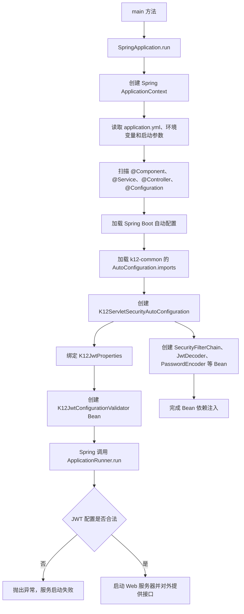
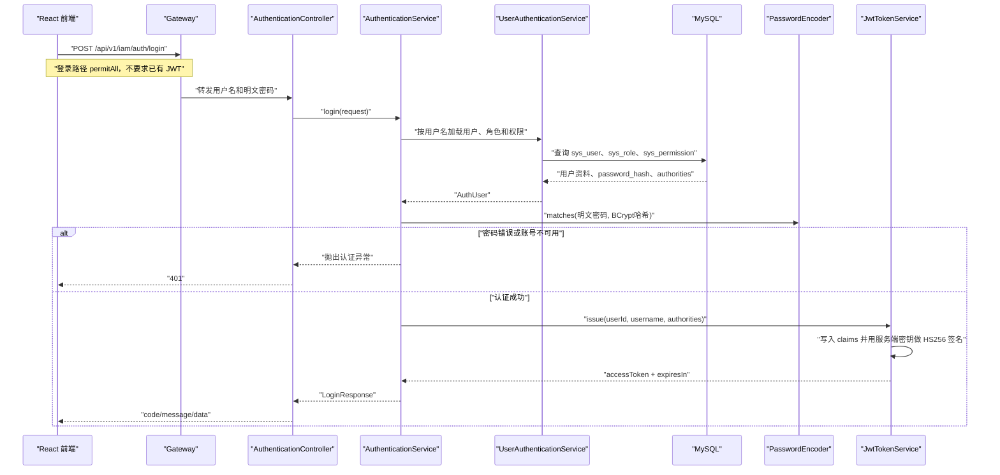
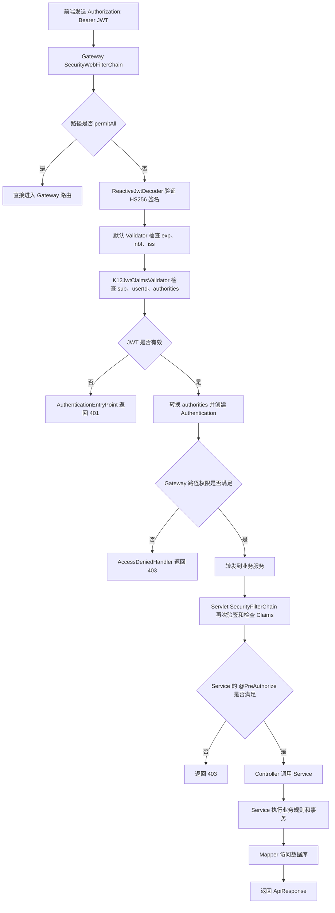

# Spring Boot 与 Spring Security JWT 整体流程笔记

本文以 K12 项目当前代码为例，整理 Spring Boot 启动、安全组件注册、登录签发 JWT、请求验签、RBAC 授权，以及以后新增接口时的标准开发步骤。

学习时先记住一句话：

```text
Spring Boot 负责创建和管理对象，Spring Security 负责在 Controller 前认证请求、在 Service 前校验权限。
```

## 1. 先分清三个阶段

整个系统不是只有一条流程，而是三个阶段：

| 阶段 | 触发时间 | 核心任务 |
|---|---|---|
| 服务启动 | 每次启动服务 | 读取配置、创建 Bean、构建安全过滤链、检查 JWT 配置 |
| 用户登录 | 用户提交用户名和密码 | 查询用户、校验密码、查询权限、签发 JWT |
| 访问业务接口 | 前端携带 JWT 请求接口 | 验签、检查 Claims、建立 Authentication、校验权限、执行业务代码 |

不要把下面两个对象混淆：

```text
K12_JWT_SECRET：服务端签名密钥，部署时生成并保存，绝不返回前端。
accessToken：用户登录后签发的 JWT，返回前端，过期后重新登录或刷新。
```

## 2. Spring Boot 启动总流程



### 2.1 启动入口

IAM 的入口是：

```java
@SpringBootApplication(scanBasePackages = "com.k12.platform")
public class K12IamServiceApplication {

    public static void main(String[] args) {
        SpringApplication.run(K12IamServiceApplication.class, args);
    }
}
```

`SpringApplication.run(...)` 不是简单地调用 `main` 后启动 Tomcat，它还会：

1. 创建 Spring 容器 `ApplicationContext`。
2. 读取配置文件、环境变量和启动参数。
3. 扫描并创建 Bean。
4. 完成构造器依赖注入。
5. 执行自动配置。
6. 启动内嵌 Web 服务器。
7. 调用 `ApplicationRunner` 和 `CommandLineRunner`。

### 2.2 什么是 Spring Bean

Bean 就是交给 Spring 容器创建、保存和管理的 Java 对象。

下面两种写法都可以产生 Bean。

组件扫描：

```java
@Service
public class UserService {
}
```

配置类显式创建：

```java
@Bean
public PasswordEncoder passwordEncoder() {
    return new BCryptPasswordEncoder();
}
```

区别是：

| 写法 | 适用场景 |
|---|---|
| `@Component/@Service/@Controller` | 自己编写并且能直接加注解的业务类 |
| `@Bean` | 第三方类，或创建过程需要自定义配置的对象 |

### 2.3 构造器注入如何发生

```java
public AuthenticationService(
        UserAuthenticationService userAuthenticationService,
        PasswordEncoder passwordEncoder,
        JwtTokenService jwtTokenService
) {
    this.userAuthenticationService = userAuthenticationService;
    this.passwordEncoder = passwordEncoder;
    this.jwtTokenService = jwtTokenService;
}
```

Spring 创建 `AuthenticationService` 时，会按照构造器参数类型，从容器中寻找对应 Bean，再传入构造器。

概念上等于：

```java
new AuthenticationService(
        容器中的UserAuthenticationService,
        容器中的PasswordEncoder,
        容器中的JwtTokenService
);
```

只有一个构造器时，不需要写 `@Autowired`。

## 3. ApplicationRunner 是什么

`ApplicationRunner` 是 Spring Boot 自带接口：

```java
public interface ApplicationRunner {
    void run(ApplicationArguments args) throws Exception;
}
```

项目中的实现：

```java
public class K12JwtConfigurationValidator implements ApplicationRunner {

    @Override
    public void run(ApplicationArguments args) {
        // 检查 JWT 配置
    }
}
```

执行条件有两个：

1. 类实现了 `ApplicationRunner`。
2. 这个类的对象是 Spring Bean。

项目通过下面的方法把它创建成 Bean：

```java
@Bean
public K12JwtConfigurationValidator k12JwtConfigurationValidator(
        K12JwtProperties properties,
        Environment environment
) {
    return new K12JwtConfigurationValidator(properties, environment);
}
```

Spring Boot 在容器初始化完成后自动调用 `run()`。它适合：

- 启动时校验关键配置。
- 初始化少量必要数据。
- 预热缓存。
- 检查外部依赖是否满足要求。

不适合在里面执行耗时很长、每次启动都会重复的大批量业务操作。

### 3.1 ApplicationArguments

`ApplicationArguments` 封装启动命令传入的参数，例如：

```powershell
java -jar app.jar --server.port=8081 --demo.enabled=true
```

可以在 `run()` 中读取这些参数。当前 JWT 检查器不需要启动参数，所以参数名 `args` 存在但没有使用。

### 3.2 ApplicationRunner 和 CommandLineRunner

两者都会在 Spring Boot 启动完成阶段自动执行。

| 接口 | `run` 参数 | 特点 |
|---|---|---|
| `ApplicationRunner` | `ApplicationArguments` | 参数已经结构化，较方便 |
| `CommandLineRunner` | `String... args` | 直接接收原始字符串数组 |

当前项目使用 `ApplicationRunner` 是合理的。

## 4. 配置绑定流程

配置文件：

```yaml
k12:
  security:
    jwt:
      issuer: ${K12_JWT_ISSUER:k12-platform}
      secret: ${K12_JWT_SECRET:k12-platform-dev-secret-change-me-2026-very-long-key}
      access-token-ttl: ${K12_JWT_ACCESS_TOKEN_TTL:30m}
```

配置类：

```java
@ConfigurationProperties(prefix = "k12.security.jwt")
public class K12JwtProperties {
    private String issuer = "k12-platform";
    private String secret = DEFAULT_DEVELOPMENT_SECRET;
    private Duration accessTokenTtl = Duration.ofMinutes(30);
}
```

注册配置类：

```java
@EnableConfigurationProperties(K12JwtProperties.class)
```

绑定过程：

```text
环境变量 / application.yml
              ↓
Spring Environment
              ↓
@ConfigurationProperties
              ↓
调用 K12JwtProperties 的 Setter
              ↓
其他 Bean 通过构造器获得最终配置对象
```

配置优先级可以先简化记成：

```text
环境变量或启动参数 > application.yml > Java 字段默认值
```

## 5. 自动配置为什么能够跨模块生效

`k12-common` 中定义了：

```java
@AutoConfiguration
public class K12ServletSecurityAutoConfiguration {
}
```

并在下面的文件中登记类名：

```text
META-INF/spring/org.springframework.boot.autoconfigure.AutoConfiguration.imports
```

业务模块依赖 `k12-common` 后，Spring Boot 会读取这个登记文件并加载自动配置，因此每个 Servlet 业务服务不需要重复写整套安全配置。

三个条件注解的含义：

| 注解 | 作用 |
|---|---|
| `@ConditionalOnWebApplication(SERVLET)` | 只在 Servlet Web 项目中加载 |
| `@ConditionalOnClass(...)` | 类路径存在 Security 相关类时才加载 |
| `@ConditionalOnMissingBean` | 业务服务没有自定义同类型 Bean 时才使用默认 Bean |

`@ConditionalOnMissingBean` 可以理解为：

```text
common 提供默认实现；业务模块有特殊需求时，可以自己定义 Bean 覆盖默认实现。
```

Gateway 使用 WebFlux，不属于 Servlet，因此不会加载 Servlet 安全链，而是在 Gateway 模块中使用 `SecurityWebFilterChain` 单独配置。

## 6. 登录与 JWT 签发流程



重点：

1. 前端提交的是明文密码，但必须通过 HTTPS 传输。
2. 数据库存的是 BCrypt 哈希，不存明文密码。
3. `PasswordEncoder.matches()` 比较明文密码和哈希。
4. JWT 中不能放密码、数据库密码等秘密数据。
5. `JwtTokenService` 返回 JWT，不返回 `K12_JWT_SECRET`。

## 7. 携带 JWT 访问接口的完整流程



### 7.1 为什么 Gateway 和业务服务都校验

Gateway 是第一层入口，业务服务是第二层防线：

```text
Gateway：尽早拒绝非法请求，统一入口规则。
业务服务：防止有人绕过 Gateway 直接访问 8081、8082 等端口。
```

生产环境还应通过防火墙或容器网络限制业务服务端口，只允许 Gateway 访问。

### 7.2 JwtDecoder 做什么

`JwtDecoder` 负责：

1. 解析 JWT。
2. 用密钥验证签名。
3. 调用配置的 `OAuth2TokenValidator`。
4. 验证成功后返回 `Jwt` 对象。

项目组合了两个 Validator：

```java
new DelegatingOAuth2TokenValidator<>(
        issuerValidator,
        new K12JwtClaimsValidator()
)
```

含义是两个验证器都必须成功。

### 7.3 Authentication 从哪里来

JWT 验证成功后，Spring Security 将 JWT 转换为 `Authentication`：

```text
JWT.sub                -> Authentication.getName()
JWT.authorities        -> Authentication.getAuthorities()
JWT 整体内容           -> Authentication.getPrincipal()
```

当前请求处理期间，`Authentication` 被放入安全上下文：

```java
SecurityContextHolder.getContext().getAuthentication();
```

项目封装了 `K12SecurityContext`，业务代码优先使用封装方法读取当前用户 ID 和权限，避免到处重复解析 JWT。

## 8. 认证与授权必须区分

```text
认证 Authentication：你是谁？JWT 是否真实有效？
授权 Authorization：你能做什么？是否拥有 user:read 等权限？
```

典型响应：

| 场景 | HTTP 状态码 | 处理组件 |
|---|---:|---|
| 没带 JWT | 401 | `AuthenticationEntryPoint` |
| JWT 过期、签名错误、Claims 非法 | 401 | `AuthenticationEntryPoint` |
| JWT 合法但没有接口权限 | 403 | `AccessDeniedHandler` 或方法安全异常处理器 |
| 参数校验失败 | 400 | Controller 异常处理器 |
| 数据不存在 | 404 | 业务代码返回 |

`permitAll()` 只表示允许匿名请求通过当前路径，不表示自动给用户登录身份。

## 9. Spring 和 Spring Security 自带类速查

### 9.1 Spring Boot 启动与配置

| 类或注解 | 来源 | 什么时候使用 | 当前项目作用 |
|---|---|---|---|
| `SpringApplication` | Spring Boot | 启动应用 | 创建容器并启动服务 |
| `@SpringBootApplication` | Spring Boot | 启动类 | 组合配置、自动配置和组件扫描 |
| `ApplicationContext` | Spring | 应用运行期间 | 保存和管理 Bean |
| `@Bean` | Spring | 在配置类中创建对象 | 创建安全链、编码器、解码器等 |
| `@ConfigurationProperties` | Spring Boot | 将配置绑定为 Java 对象 | 绑定 `k12.security.jwt` |
| `@EnableConfigurationProperties` | Spring Boot | 注册配置属性类 | 让 `K12JwtProperties` 成为 Bean |
| `Environment` | Spring | 读取当前运行环境 | 判断是否激活 `prod` |
| `ApplicationRunner` | Spring Boot | 容器初始化后执行一次 | 启动时检查 JWT 配置 |
| `ApplicationArguments` | Spring Boot | 读取启动参数 | 作为 `ApplicationRunner.run` 参数 |
| `@AutoConfiguration` | Spring Boot | 编写可复用自动配置 | common 自动给业务服务配置安全链 |
| `@ConditionalOnMissingBean` | Spring Boot | 提供可覆盖的默认 Bean | 业务模块自定义后默认配置让位 |

### 9.2 Web 与分层

| 类或注解 | 作用 |
|---|---|
| `@RestController` | 声明 HTTP Controller，返回 JSON |
| `@RequestMapping` | 声明公共 URL 前缀 |
| `@GetMapping/@PostMapping/...` | 声明 HTTP 方法和路径 |
| `@RequestBody` | 把 JSON 请求体反序列化为 Java 对象 |
| `@PathVariable` | 读取 URL 路径变量 |
| `@Valid` | 触发 DTO 参数校验 |
| `@Service` | 声明业务层 Bean |
| `@Transactional` | 方法成功时提交事务，异常时回滚 |
| `ResponseEntity` | 同时控制 HTTP 状态码、响应头和响应体 |

### 9.3 Spring Security

| 类或接口 | 作用 | 当前项目用法 |
|---|---|---|
| `SecurityFilterChain` | Servlet 请求进入 Controller 前的安全过滤链 | IAM 和普通业务服务使用 |
| `HttpSecurity` | 构建 Servlet 安全规则 | 配置 CSRF、路径权限和资源服务器 |
| `SecurityWebFilterChain` | WebFlux 的响应式安全过滤链 | Gateway 使用 |
| `ServerHttpSecurity` | 构建 WebFlux 安全规则 | Gateway 使用 |
| `PasswordEncoder` | 密码哈希和匹配的统一接口 | 使用 BCrypt |
| `JwtEncoder` | 签发 JWT | 只在 IAM 使用 |
| `JwtDecoder` | 同步解析和验证 JWT | Servlet 服务使用 |
| `ReactiveJwtDecoder` | 响应式解析和验证 JWT | Gateway 使用 |
| `OAuth2TokenValidator<Jwt>` | 自定义 JWT 验证契约 | 检查 K12 自定义 Claims |
| `DelegatingOAuth2TokenValidator` | 组合多个验证器 | 标准校验和 K12 校验都要通过 |
| `JwtAuthenticationConverter` | 把 `Jwt` 转换为 `Authentication` | 读取 `authorities` Claim |
| `Authentication` | 当前已认证用户的统一表示 | 读取用户名和权限 |
| `SecurityContextHolder` | Servlet 当前线程的安全上下文 | 保存当前 `Authentication` |
| `@EnableMethodSecurity` | 开启方法级权限 | 让 `@PreAuthorize` 生效 |
| `@PreAuthorize` | 调用方法前执行权限表达式 | Service 层二次授权 |
| `AuthenticationEntryPoint` | 处理未认证或无效凭证 | 返回统一 401 JSON |
| `AccessDeniedHandler` | 处理已认证但无权限 | 返回统一 403 JSON |
| `SessionCreationPolicy.STATELESS` | 禁止使用服务端登录 Session | JWT 接口保持无状态 |

### 9.4 不需要自己手写 JWT Filter

当前项目已经引入 Spring Security OAuth2 Resource Server：

```java
.oauth2ResourceServer(resourceServer -> resourceServer.jwt(...))
```

它已经负责：

- 从 `Authorization: Bearer ...` 读取令牌。
- 调用 `JwtDecoder` 验证令牌。
- 构造 `Authentication`。
- 写入安全上下文。

因此没有必要再手写一个 `OncePerRequestFilter` 重复解析 JWT。重复实现容易造成过滤顺序、异常处理和上下文写入错误。

## 10. K12 项目自定义安全类速查

| 自定义类 | 所在模块 | 职责 |
|---|---|---|
| `K12JwtProperties` | common | 保存 issuer、secret、JWT 有效期 |
| `K12JwtConfigurationValidator` | common | 服务启动时检查 JWT 配置 |
| `K12JwtClaimsValidator` | common | 每次验签时检查 userId、sub、authorities |
| `K12Authorities` | common | 集中保存角色和权限常量 |
| `K12SecurityContext` | common | 统一读取当前用户 ID 和权限 |
| `K12SecurityErrorWriter` | common | Servlet 服务输出统一 401/403 JSON |
| `K12MethodSecurityExceptionHandler` | common | 处理方法级权限异常 |
| `K12ServletSecurityAutoConfiguration` | common | 普通业务服务的默认安全配置 |
| `SecurityConfig` | gateway | Gateway WebFlux 安全配置 |
| `GatewaySecurityErrorWriter` | gateway | Gateway 输出统一 401/403 JSON |
| `UserAuthenticationService` | IAM | 从数据库加载用户、角色和权限 |
| `AuthenticationService` | IAM | 编排登录、密码校验和签发令牌 |
| `JwtEncoderConfiguration` | IAM | 创建 JWT 签名器 `JwtEncoder` |
| `JwtTokenService` | IAM | 构造 Claims 并签发 JWT |

## 11. RBAC 在项目中的数据流

数据库关系：

```text
sys_user
   ↓ sys_user_role
sys_role
   ↓ sys_role_permission
sys_permission
```

登录查询结果形成：

```json
[
  "ROLE_ADMIN",
  "user:read",
  "user:create"
]
```

然后写入 JWT：

```json
{
  "authorities": [
    "ROLE_ADMIN",
    "user:read",
    "user:create"
  ]
}
```

接口通过下面的表达式判断：

```java
@PreAuthorize("hasAuthority('user:read')")
```

角色也是一种 Authority：

```java
@PreAuthorize("hasAuthority('ROLE_ADMIN')")
```

当前项目常用写法：

```java
@PreAuthorize(
    "hasAuthority('ROLE_ADMIN') or hasAuthority('user:read')"
)
```

## 12. 以后新增一个受保护接口的标准流程

假设新增“查看题目”接口，权限编码为 `question:read`。

### 第一步：设计接口和权限

先确定：

```text
资源：question
操作：read/create/update/delete
URL：/api/v1/questions
允许角色：管理员、教师或拥有细粒度权限的用户
是否存在数据范围限制：教师只能看自己的课程题目？
```

功能权限和数据权限不是一回事：

```text
@PreAuthorize：判断能不能调用“查看题目”功能。
WHERE 条件：判断能查看哪些题目数据。
```

### 第二步：数据库增加权限

向 `sys_permission` 增加：

```text
question:read
question:create
question:update
question:delete
```

再通过 `sys_role_permission` 分配给相应角色。初始化或升级 SQL 必须可重复执行，避免重复数据错误。

### 第三步：增加权限常量

在 `K12Authorities` 中集中声明：

```java
public static final String QUESTION_READ = "question:read";
public static final String QUESTION_CREATE = "question:create";
public static final String QUESTION_UPDATE = "question:update";
public static final String QUESTION_DELETE = "question:delete";
```

不要在不同 Service 中到处手写字符串，避免拼写不一致。

### 第四步：按分层创建代码

推荐目录：

```text
question/
├── web/QuestionController.java
├── service/QuestionService.java
├── mapper/QuestionMapper.java
├── model/Question.java
└── dto/
    ├── QuestionCreateRequest.java
    ├── QuestionUpdateRequest.java
    └── QuestionResponse.java

resources/mapper/QuestionMapper.xml
```

职责必须保持清楚：

| 层 | 应该做 | 不应该做 |
|---|---|---|
| Controller | 接收参数、触发校验、选择 HTTP 状态码 | 写 SQL、加密密码、编排复杂业务 |
| Service | 业务规则、事务、权限和数据范围 | 直接拼 HTTP 响应细节 |
| Mapper | 查询和修改数据库 | 决定用户是否有业务权限 |
| DTO | 定义接口输入输出 | 承担数据库持久化逻辑 |
| Entity/Model | 映射数据库字段 | 直接返回敏感字段给前端 |

### 第五步：Service 添加方法权限

```java
@Service
public class QuestionService {

    @PreAuthorize(
        "hasAuthority('" + K12Authorities.ROLE_ADMIN + "') "
        + "or hasAuthority('" + K12Authorities.QUESTION_READ + "')"
    )
    public List<QuestionResponse> listQuestions() {
        return questionMapper.findVisibleQuestions(
                K12SecurityContext.currentUserId().orElseThrow()
        );
    }
}
```

权限注解优先放在 `public Service` 方法上，因为 Service 可能被 Controller、定时任务或其他服务入口调用。

注意：同一个类中 `this.someMethod()` 的内部调用通常不会经过 Spring AOP 代理，不要依赖内部调用触发 `@PreAuthorize`。

### 第六步：Mapper 落实数据权限

如果教师只能读取自己课程的数据，SQL 必须有限制条件，例如：

```sql
SELECT q.id, q.title, q.course_id
FROM question q
JOIN course_teacher ct ON ct.course_id = q.course_id
WHERE ct.teacher_user_id = #{currentUserId}
  AND q.deleted = 0;
```

不能只写：

```sql
SELECT * FROM question;
```

因为 `question:read` 只能说明有读取功能，不代表可以读取全系统数据。

### 第七步：Controller 保持薄层

```java
@RestController
@RequestMapping("/api/v1/questions")
public class QuestionController {

    private final QuestionService questionService;

    public QuestionController(QuestionService questionService) {
        this.questionService = questionService;
    }

    @GetMapping
    public ApiResponse<List<QuestionResponse>> listQuestions() {
        return ApiResponse.ok(questionService.listQuestions());
    }
}
```

### 第八步：Gateway 和 Servlet 路径规则同步

在 Gateway 的 `SecurityConfig` 增加第一层路径权限：

```java
.pathMatchers(HttpMethod.GET, "/api/v1/questions/**")
.hasAnyAuthority(K12Authorities.ROLE_ADMIN, K12Authorities.QUESTION_READ)
```

在 common 的 Servlet 安全配置增加对应规则：

```java
.requestMatchers(HttpMethod.GET, "/api/v1/questions/**")
.hasAnyAuthority(K12Authorities.ROLE_ADMIN, K12Authorities.QUESTION_READ)
```

Service 中仍然保留 `@PreAuthorize`。三层规则的职责是：

```text
Gateway 路径规则：入口尽早拦截。
Servlet 路径规则：业务服务自身保护。
Service @PreAuthorize：保护业务方法。
```

当前项目需要手动保持这三处一致。后续权限规则很多时，可以再抽取统一的路径权限描述，避免重复维护；在规模较小时先保持直接明确。

### 第九步：判断是否匿名放行

只有明确允许匿名调用的接口才加入 `permitAll`，例如：

```text
登录
注册学生
健康检查
```

普通 CRUD 不要加入 `permitAll`。默认使用：

```java
.anyRequest().authenticated()
```

保证新增但尚未写细粒度规则的接口至少要求登录。

### 第十步：编写测试

至少覆盖：

| 测试 | 预期结果 |
|---|---|
| 不带 JWT | 401 |
| JWT 过期或签名错误 | 401 |
| JWT 合法但没有权限 | 403 |
| 有权限且数据属于当前用户范围 | 200 |
| 有功能权限但访问他人数据 | 404 或 403，按接口规范决定 |
| 创建或更新失败 | 事务回滚，不留下半成品数据 |

### 第十一步：更新 OpenAPI 和 Apifox

文档中至少写清：

- 请求方法和路径。
- Bearer JWT 认证要求。
- 请求 DTO。
- 成功响应。
- `400/401/403/404` 响应。
- 权限编码。

## 13. 新增接口检查清单

每次开发完成后按顺序检查：

```text
[ ] 数据库表、索引和必要外键已设计
[ ] 权限编码遵循 resource:action
[ ] sys_permission 和角色权限关系已更新
[ ] K12Authorities 已增加常量
[ ] Request DTO 有参数校验
[ ] Response DTO 没有密码哈希等敏感字段
[ ] Controller 只负责 HTTP 层
[ ] Service 负责事务和业务规则
[ ] public Service 方法添加了 @PreAuthorize
[ ] Mapper 查询包含数据范围和 deleted/status 条件
[ ] UPDATE/DELETE SQL 有明确 WHERE 条件
[ ] Gateway 路径规则已添加
[ ] Servlet 路径规则已添加
[ ] 未误加 permitAll
[ ] 401、403、正常请求都已测试
[ ] OpenAPI JSON 已同步
```

## 14. 哪些内容需要理解，哪些可以查文档

必须真正理解：

1. Bean、依赖注入和构造器注入。
2. Controller、Service、Mapper 的职责边界。
3. 认证和授权的区别。
4. JWT 签名密钥与访问令牌的区别。
5. `401` 和 `403` 的区别。
6. `SecurityFilterChain` 在 Controller 前执行。
7. `@PreAuthorize` 在 Service 方法前执行。
8. 功能权限与数据权限的区别。
9. 密码必须哈希，JWT 不能保存秘密数据。

可以在写代码时查询：

- `HttpSecurity` 每个链式方法的准确语法。
- 正则表达式细节。
- `ApplicationRunner` 和其他生命周期接口的完整列表。
- Spring Security 内部过滤器的具体顺序。
- OAuth2/OIDC 的完整协议细节。

不需要背完整配置代码。需要掌握的是每个组件为什么存在、在什么时候执行、失败后返回什么。

## 15. 推荐阅读顺序

按照下面顺序读项目代码：

1. `K12JwtProperties`：JWT 配置从哪里来。
2. `K12JwtConfigurationValidator`：启动时如何检查配置。
3. `K12JwtClaimsValidator`：每个 JWT 必须包含什么。
4. `JwtEncoderConfiguration`：IAM 如何获得签名器。
5. `JwtTokenService`：登录成功后如何签发 JWT。
6. `UserAuthenticationService`：如何从数据库加载用户和权限。
7. `AuthenticationService`：如何校验密码并编排登录。
8. `AuthenticationController`：登录接口如何暴露给前端。
9. `K12ServletSecurityAutoConfiguration`：普通服务如何验签和授权。
10. Gateway `SecurityConfig`：网关如何进行第一层校验。
11. `K12SecurityContext`：业务代码如何读取当前用户。
12. 任意一个带 `@PreAuthorize` 的 Service：权限如何落到业务方法。

读每个类时固定回答四个问题：

```text
谁创建这个对象？
什么时候调用这个方法？
输入从哪里来？
成功和失败分别流向哪里？
```

能够回答这四个问题，就不需要死记 Spring Security 的全部源码。
